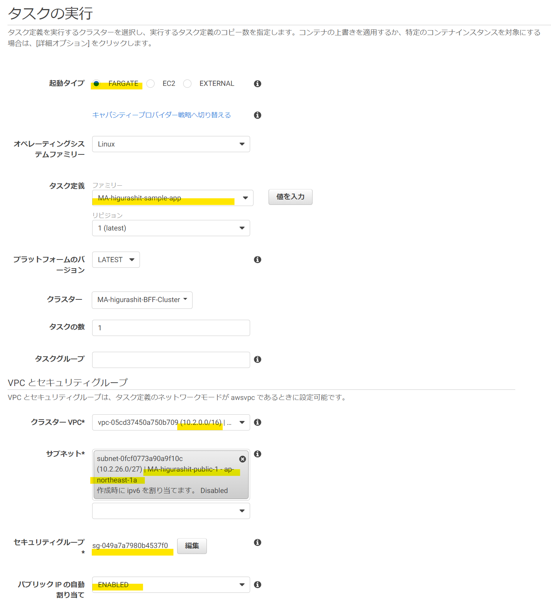
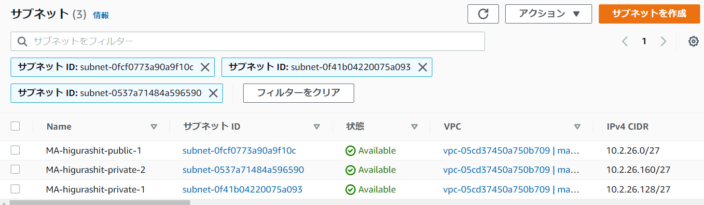
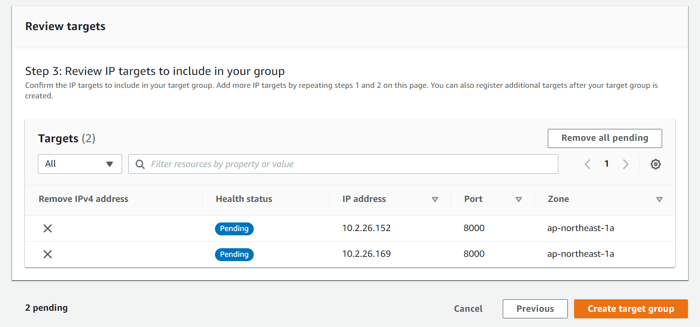

# Serverless Container（AWS Fargate）による BFF

[Back to Top](./index.md)

## 前提

- BFF（NextJS など）がコンテナ化され、DockerHub など Pull できる箇所に配置されていること

## まとめ

- サブネットの作成
  - VPC を作成
  - サブネットを 2 つの AZ で 4 つ作成
    - ALB 用: パブリックサブネットが 2 つ必要（AZ を分ける）
    - ECS 用: プライベートサブネットが 2 つ必要（ALB の AZ に合わせる）
  - 以下、設定例
    - パブリックサブネット
      - インターネットゲートウェイ を VPC 上に作成
      - サブネットを ap-northeast-1a, ap-northeast-1c に作成
      - ルートテーブルの 0.0.0.0/0 に インターネットゲートウェイ を設定
    - パブリックサブネット
      - Elastic IP を作成
      - NAT ゲートウェイ をパブリックサブネット上に作成し Elastic IP を紐付け
      - サブネットを ap-northeast-1a, ap-northeast-1c に作成
      - ルートテーブルの 0.0.0.0/0 に NAT ネットゲートウェイ を設定
- ALB の作成
  - マネジメントコンソールから「ロードバランサー」を選択
  - Sheme は「Internet-facing」を選択（ブラウザからアクセスするため）
  - VPC を指定、サブネットはパブリックサブネットを 2 つ指定
  - Security groups は「Create new security group」を選択
    - セキュリティグループはインバウンドの 80（HTTP）を指定
  - Listeners and routing は 80 番ポートで「Create target group」を選択
    - target type は「IP addresses」を指定
    - VPC に作成した VPC を指定
    - Protocol version は 「HTTP1」を指定
    - 「Next」を押し、IP アドレスは設定せずに Create（IP アドレスは ECS サービスで自動設定される）
- ECS の作成
  - ECS クラスタの作成
    - マネジメントコンソールから作成する
    - クラスタテンプレートは「ネットワーキングのみ」を選択
  - タスク定義の作成
    - マネジメントコンソールから作成する
    - 起動タイプは「FARGATE」を選択
    - タスクロールは空、タスク実行ロールはログ出力（AmazonECSTaskExecutionRolePolicy）のみ設定
      - タスクロール: タスクから AWS リソースを触るためのロール
      - タスク実行ロール: タスクを実行するためのロール
    - オペレーティングシステムファミリーは「Linux」を選択
    - タスクサイズは適切に設定する（検証はミニマムで実施）
    - コンテナの定義
      - DockerHub などのリポジトリに保存しているコンテナイメージを設定する
      - ポートはホストは任意（ターゲットグループで指定するため）、コンテナはコンテナ動作ポートを指定
      - 残りはデフォルトで設定
  - サービスの作成
    - 起動タイプは「FARGATE」を指定
    - オペレーティングシステムファミリーは「Linux」を選択
    - タスク定義は作成したものを設定
    - タスクの数は適切に設定する（検証は 2, 4 で実施）
    - 「次へ」を選択
    - クラスター VPC に作成した VPC を設定
    - サブネットはプライベートサブネットを指定（ALB に対応している 2 つを指定）
    - セキュリティグループは「編集」を押して新規作成する
      - インバウンドにコンテナ動作ポートのみを指定
    - パブリック IP の自動割当は false（プライベートサブネットに配置するため）
    - ロードバランサーの種類は「Application Load Balancer」を指定
    - ロードバランサー名に作成した ALB を指定
    - ロードバランス用のコンテナは「ロードバランサーに追加」を選択
      - プロダクションリスナーポートは「80:HTTP」を指定
      - ターゲットグループ名は作成したターゲットグループを指定
    - 「次へ」「次へ」「サービスの作成」で設定完了

# 以下、検証内容

## コンテナ・AWS Fargate とは

https://dev.classmethod.jp/articles/developers-io-2020-connect-kaji-ecs-fargate/
https://www.youtube.com/watch?v=rwwOoFBq2AU

---

## BFF とは

---

## AWS Fargate × BFF のアーキテクチャ

---

## AWS Fargate × BFF の実装

塾長の記事[1]も参考にする

### ECS の利用開始

○ 用語の説明  
https://qiita.com/niisan-tokyo/items/4e72c6c11c3f9562fe66
https://qiita.com/IgnorantCoder/items/d4f16b1aadd1c03c0e26

- クラスター：コンテナインスタンスをまとめたもの
- タスク：アプリケーションのまとまり（1~複数のコンテナ定義を含む）
- サービス：タスクの起動数管理、target group との紐付け

### タスクの定義

ロールの作成が 2 箇所必要??  
https://qiita.com/IgnorantCoder/items/d4f16b1aadd1c03c0e26

> マネージドサービスのための権限管理のためにロールという概念が存在します。ECS には各タスクのロールとタスクを実行するためのロールの 2 つのロールがアタッチできます。今回はタスクから、その他の AWS リソースには触りにいかないため前者は設定せず、タスクを実行するためのロールだけを追加しておきましょう。

- タスクロール：タスクから AWS リソースを触るためのロール
- タスク実行ロール：タスクを実行するためのロール（ログ出力）
  
  

タスク実行ロールのみ作成する

タスク設定の続きを行う

- タスクロール：なし
- タスク実行ロール：上記で作成したロール

コンテナ定義はとりあえず必須だけ埋める

### ECS についての調査

https://www.youtube.com/watch?v=rwwOoFBq2AU
○awsvpc ネットワークモード

- Fargate はタスクごとに ENI が自動割当される（ALB を使わない場合、ENI の Public IP でアクセス可能）
- Task 内のコンテナは localhost インターフェースを共有
- VPC 内のリソースへ privateIP で通信が可能
- ALB/NLB のターゲットグループの target type は IP となる

○Public subnet にタスクを置く場合  
VPC -> Public subnet -> Internet GW -> ENI -> Task  
のイメージ（Internet ではなく S3 や ECR へのアクセスは VPC エンドポイントで OK）

○Private subnet にタスクを置く場合  
VPC -> Public subnet -> Internet GW -> ALB -> Private subnet -> Task  
のイメージ

○ 利用するサブネット  
VPC 10.2.0.0/16  
個人サブネット 10.2.26.0/24
https://dev.classmethod.jp/articles/vpc-subnet-design/

- Public Subnet (10.2.26.0/25)
  - 10.2.26.0
  - 10.2.26.1
  - 10.2.26.2
  - 10.2.26.3
- Private Subnet (10.2.26.128/25)
  - 10.2.26.128
  - 10.2.26.129
  - 10.2.26.130
  - 10.2.26.131
- 実は切り方が不適切（問題 3 へ）
  
  

○Amazon CloudWatch Container Insights

○ サイドカーコンテナ
https://qiita.com/MahoTakara/items/03fc0afe29379026c1f3

○SLA

### Public での ECS タスク作成

- タスクを 1 つパブリックサブネットで実行
- 外部からアクセスする

新しいタスクの実行

パブリックサブネットを指定

【問題 1】作成できたが「PENDING」からステータスが変わらない…

- 【解決】サブネットのルートテーブルに InternetGW が設定されていなかったため

【問題 2】タスクが RUNNNING するようになったが、アクセスできない…

- 【解決】以下の stackoverflow を見ると ENI（Elastic Network Interface）にセキュリティグループをアタッチする必要がありそう
  https://stackoverflow.com/questions/64596558/aws-fargate-container-not-accessible
  
- このタスクでは 8000 番ポートを使用しているので 8000 番のインバウンドを許可する
  

- 閲覧できるようになった
  

### Private での ECS タスク作成

- タスクを 4 つプライベートサブネットで実行
- サービス設定で ALB を置く構成
  

新しいタスクの実行で同様にタスクを設定するが、プライベートサブネットにする

PENDING になってしまう

- 以下を見ると、NAT ゲートウェイ作成し、サービスでアタッチする必要がありそう
  https://aws.amazon.com/jp/premiumsupport/knowledge-center/ecs-fargate-tasks-pending-state/
- NATGW を作成する

  - パブリックサブネットに配置
  - ElasticIP を設定
    
  - プライベートサブネットのルートテーブルの送信先に NATGW を設定
    
    

- サービスの設定
  - プライベートサブネットに、1 タスク、ロードバランサーなしで設定
    
    
    
    
    
- 【問題 3】アクセスできない…

  - 【解決】ルートテーブルで許可しているのはプライベート → パブリックのルートなので、ALB を置かないと外からは見えない
  - https://aws.amazon.com/jp/premiumsupport/knowledge-center/create-alb-auto-register/
    - インターネット →ALB(80 番ポート) → ECS(8000 番ポート) のルーティングを設定する
  - ALB を指定してロードバランサーを作成
    
  - 【問題】2 つサブネットが必要であり、CIDR を大きく切りすぎたため、再作成…
    - 現行
      - Public： 0 0000000 /25 .0
      - Private：1 0000000 /25 .128
    - 修正後
      - Public：
        - 000 00000 /27 .0 ~ 011 00000 /27 .96 の 4 つ
      - Private：
        - 100 00000 /27 .128 ~ 111 00000 /27 .224 　の 4 つ
  - サブネットを削除するため、サブネット内のリソースを削除
    - ECS サービスの削除
    - ECS タスクの停止
    - NAT ゲートウェイの削除
  - サブネットを削除
  - サブネットを新規作成
    - MA-higurashit-public-1：10.2.26.0/27（ap-northeast-1a）
    - MA-higurashit-private-1：10.2.26.128/27（ap-northeast-1c）
    - MA-higurashit-private-2：10.2.26.160/27（ap-northeast-1d）
    - 実は不足している…（問題 5 へ）
      
  - サブネット設定~タスク起動のおさらい
    - パブリックサブネットにインターネットゲートウェイを作成
    - NAT ゲートウェイをパブリックサブネットに設定
    - プライベートサブネット 1, 2 のルートテーブルに NAT ゲートウェイを設定
    - パブリックサブネットに 1 つタスクを実行し RUNNING&ブラウザ確認
    - プライベートサブネット 1 にタスクを実行し RUNNNIG
    - プライベートサブネット 2 にタスクを実行し RUNNNIG
      

- ALB の設定に戻る
  - Basic configuration
    - Scheme：~~Internal（private サブネットに接続するため）~~ 間違い（問題 4 へ）
    - IP address type：IPv4（なんとなく）
  - Network mappingInfo
    - VPC：個人用 VPC
    - Mappings：~~プライベートサブネット 1, 2 を設定~~ 間違い（問題 5 へ）
      
  - Security groups
    - インバウンドの 80 番ポートを開放したセキュリティグループを設定（ALB は 80 番のみ受付）
      
      
  - Listeners and routing
    - 80 番ポートをリスニング
      
      - ※target group の作成
      - IP アドレス - ポートは 8000 番
      - プライベートサブネット上の ECS を指定
        - 10.2.26.152
        - 10.2.26.169
          
          
          
        - 【問題】エラーが発生。なぜか Zone が ap-northeast-1a になっている（本来は 1c, 1d）
          
        - 【解決】時間をおいてやってみたら、直った。時間…
          
  - Summary
    - 設定内容を確認
      
- 改めて、サービスの設定を行う
  - Fargate で 4 タスクを起動
    
  - プライベートサブネット 2 つに 4 タスクを起動
  - セキュリティグループは インバウンドの 8000 番ポートを受け付けるセキュリティグループにする
    
  - ALB を作成、80 番ポートを受け取って、HTTP8000 番に流す
    
  - 作成完了し、新たに 4 タスクが起動した（手動で作成した private タスクは不要のため削除）
    
  - ターゲットグループも同様に手動で作成した private タスクを Deregister する
    
- 【問題 4】ヘルスチェックは helthy になっているのに、アクセスできない
  - 【解決】外部からアクセスする ALB は internet-facing だった
  - ALB を作り直す…
    - ECS サービスの削除
    - ALB の削除（これで新 ALB に以前作成した Target Group が設定できる
    - ALB の再作成
      - Scheme を Internet-facing にする
      - 【問題 5】Internet-facing の ALB はパブリックサブネットを指定しないとだめだという警告が出る
        - 【解決】[ここ](https://blog.serverworks.co.jp/alb-private-subnet) に書いてあるように、そもそも認識誤り
        - パブリックサブネットも 2 つ必要、かつ、プライベートサブネットに合わせた AZ に配置する（実際は同 AZ のパブリックサブネット経由でルーティングする）
          - MA-higurashit-public-2：10.2.26.32/27（ap-northeast-1c）
          - MA-higurashit-public-3：10.2.26.64/27（ap-northeast-1d）
            
      - 再作成完了
        
    - ECS サービスの再作成（前回と一緒）
- ALB の DNS 経由でアクセスしたらコンテナにアクセスができた
  

## （余力があれば）Cognito による認証との連携

---

## （余力があれば）レスポンス高速化の勘所

---

## まとめ

---

[Back to Top](./index.md)

[1]: https://news.mynavi.jp/itsearch/article/devsoft/4354
