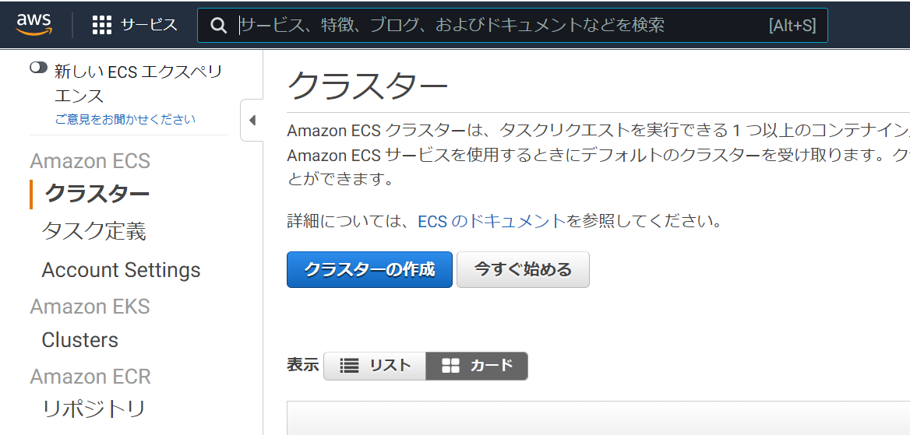

# Serverless Container（AWS Fargate）による BFF

[Back to Top](./index.md)

## コンテナ・AWS Fargate とは

https://dev.classmethod.jp/articles/developers-io-2020-connect-kaji-ecs-fargate/
https://www.youtube.com/watch?v=rwwOoFBq2AU

---

## BFF とは

---

## AWS Fargate × BFF のアーキテクチャ

---

## AWS Fargate × BFF の実装

塾長の記事[1]も参考にする

### ECS の利用開始

○ 用語の説明  
https://qiita.com/niisan-tokyo/items/4e72c6c11c3f9562fe66
https://qiita.com/IgnorantCoder/items/d4f16b1aadd1c03c0e26

- クラスター：コンテナインスタンスをまとめたもの
- タスク：アプリケーションのまとまり（1~複数のコンテナ定義を含む）
- サービス：タスクの起動数管理、target group との紐付け

### タスクの定義

ロールの作成が 2 箇所必要??  
https://qiita.com/IgnorantCoder/items/d4f16b1aadd1c03c0e26

> マネージドサービスのための権限管理のためにロールという概念が存在します。ECS には各タスクのロールとタスクを実行するためのロールの 2 つのロールがアタッチできます。今回はタスクから、その他の AWS リソースには触りにいかないため前者は設定せず、タスクを実行するためのロールだけを追加しておきましょう。

- タスクロール：タスクから AWS リソースを触るためのロール
- タスク実行ロール：タスクを実行するためのロール（ログ出力）
  
  

タスク実行ロールのみ作成する

タスク設定の続きを行う

- タスクロール：なし
- タスク実行ロール：上記で作成したロール

コンテナ定義はとりあえず必須だけ埋める

### ECS についての調査

https://www.youtube.com/watch?v=rwwOoFBq2AU
○awsvpc ネットワークモード

- Fargate はタスクごとに ENI が自動割当される（ALB を使わない場合、ENI の Public IP でアクセス可能）
- Task 内のコンテナは localhost インターフェースを共有
- VPC 内のリソースへ privateIP で通信が可能
- ALB/NLB のターゲットグループの target type は IP となる

○Public subnet にタスクを置く場合  
VPC -> Public subnet -> Internet GW -> ENI -> Task  
のイメージ（Internet ではなく S3 や ECR へのアクセスは VPC エンドポイントで OK）

○Private subnet にタスクを置く場合  
VPC -> Public subnet -> Internet GW -> ALB -> Private subnet -> Task  
のイメージ

○ 利用するサブネット  
VPC 10.2.0.0/16  
個人サブネット 10.2.26.0/24
https://dev.classmethod.jp/articles/vpc-subnet-design/

- Public Subnet (10.2.26.0/25)
  - 10.2.26.0
  - 10.2.26.1
  - 10.2.26.2
  - 10.2.26.3
- Private Subnet (10.2.26.128/25)
  - 10.2.26.128
  - 10.2.26.129
  - 10.2.26.130
  - 10.2.26.131

○Amazon CloudWatch Container Insights

○ サイドカーコンテナ
https://qiita.com/MahoTakara/items/03fc0afe29379026c1f3

○SLA

### Public での ECS タスク作成

### Private での ECS タスク作成

### Private での ECS サービス作成

## （余力があれば）Cognito による認証との連携

---

## （余力があれば）レスポンス高速化の勘所

---

## まとめ

---

[Back to Top](./index.md)

[1]: https://news.mynavi.jp/itsearch/article/devsoft/4354
