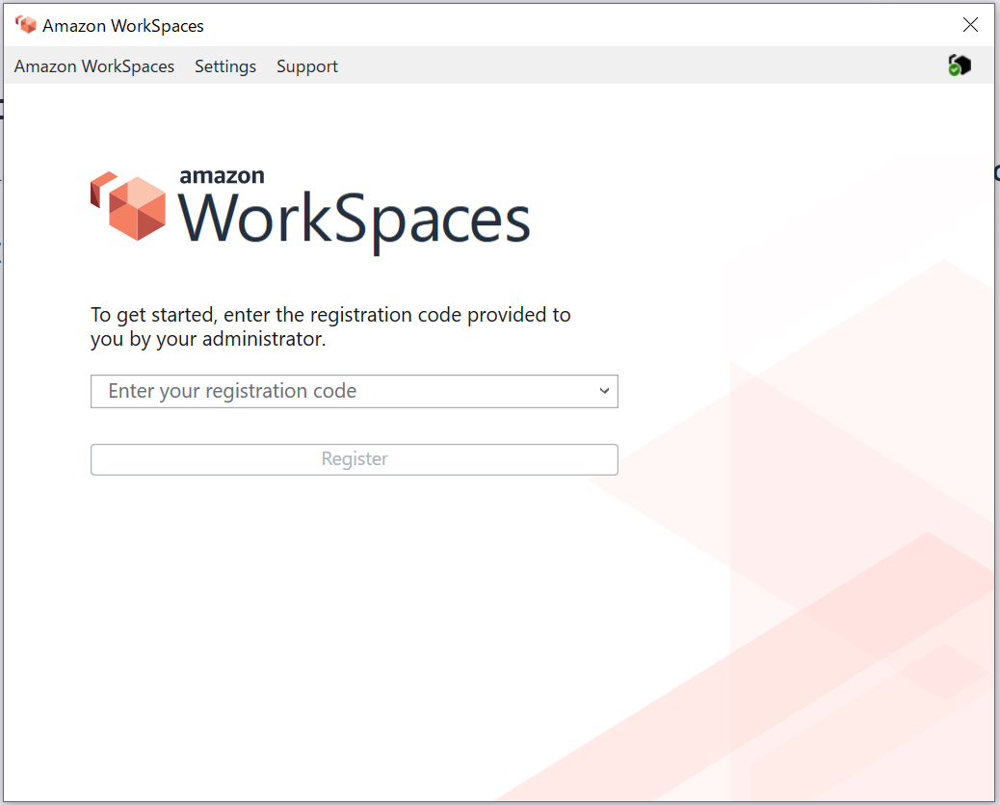
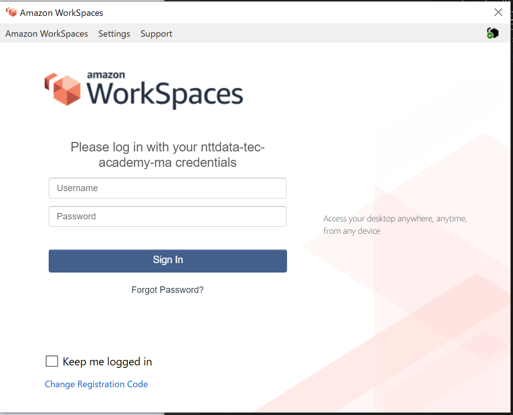
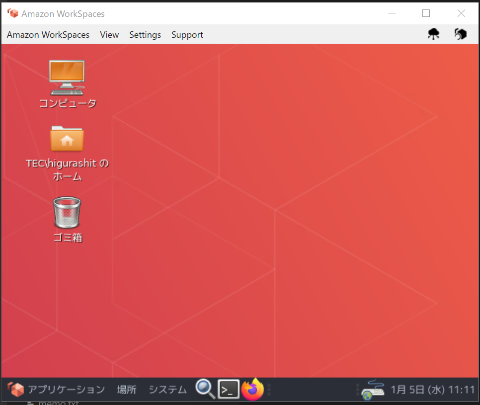
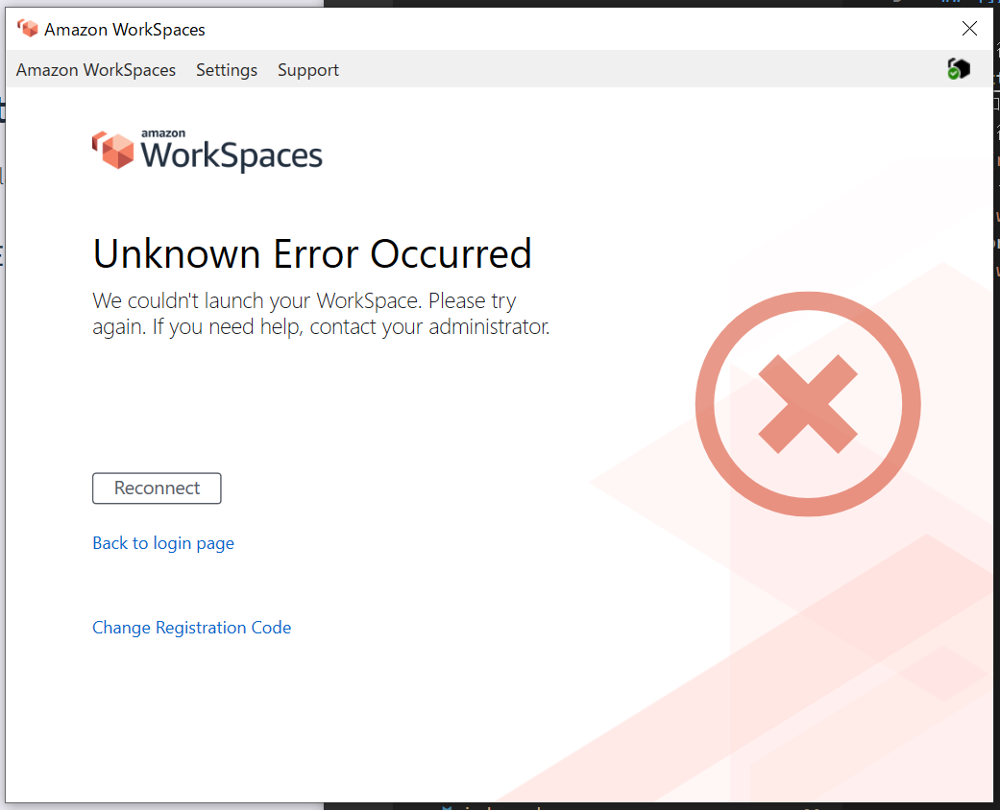

# WorkSpaces について

## 利用開始まで

1. 招待メールを受け取る（リンク有効期限切れ・・・）
1. https://clients.amazonworkspaces.com/ から「Windows Latest 64 Bit 版」のクライアントをダウンロードしてインストール
1. 招待メールの登録コードを入力
   
1. ログインを実施
   
1. WorkSpaces が起動する
   
1. 色々動かす
   1. ファイル作成
   1. ブラウザ起動
   1. ターミナル起動
1. OK!!

## 初期設定

1.  インストールされているアプリケーションの update
    - `sudo yum -y update`
    - amzn2-core, firefox のみ
1.  Docker のインストール

    - `sudo yum install -y docker`
      - docker.x86_64 0:20.10.7-5.amzn2 がインストールされる
      - docker グループが作成される
    - `sudo systemctl start docker`
      - docker が起動される
    - `sudo usermod -a -G docker $USER`
      - docker コマンドを sudo なしで使う
    - `sudo systemctl enable docker`
      - docker サービスの自動起動を有効にする
    - `docker version`  
      なんかエラー出てる…権限が足りてない??

    ```
    [TEC\higurashit@a-3mpaoy5w8ussf ~]$ docker version
    Client:
    Version:           20.10.7
    API version:       1.41
    Go version:        go1.15.14
    Git commit:        f0df350
    Built:             Wed Nov 17 03:05:36 2021
    OS/Arch:           linux/amd64
    Context:           default
    Experimental:      true
    Got permission denied while trying to connect to the Docker daemon socket at unix:///var/run/docker.sock: Get "http://%2Fvar%2Frun%2Fdocker.sock/v1.24/version": dial unix /var/run/docker.sock: connect: permission denied
    ```

    - `sudo docker version`  
      エラーが出なくなった。権限周りでミスってる  
      → ［解決］プロンプト再起動じゃなくて WorkSpaces 再起動しないとだめでした

    ```
    [TEC\higurashit@a-3mpaoy5w8ussf ~]$ sudo docker version
    Client:
    Version: 20.10.7
    API version: 1.41
    Go version: go1.15.14
    Git commit: f0df350
    Built: Wed Nov 17 03:05:36 2021
    OS/Arch: linux/amd64
    Context: default
    Experimental: true

    Server:
    Engine:
    Version: 20.10.7
    API version: 1.41 (minimum version 1.12)
    Go version: go1.15.14
    Git commit: b0f5bc3
    Built: Wed Nov 17 03:06:14 2021
    OS/Arch: linux/amd64
    Experimental: false
    containerd:
    Version: 1.4.6
    GitCommit: d71fcd7d8303cbf684402823e425e9dd2e99285d
    runc:
    Version: 1.0.0
    GitCommit: 84113eef6fc27af1b01b3181f31bbaf708715301
    docker-init:
    Version: 0.19.0
    GitCommit: de40ad0
    [TEC\higurashit@a-3mpaoy5w8ussf ~]$
    ```

1.  Docker Compose のインストール
    - [公式サイト](https://docs.docker.com/compose/install/)を参照
    - `sudo curl -L "https://github.com/docker/compose/releases/download/1.29.2/docker-compose-$(uname -s)-$(uname -m)" -o /usr/local/bin/docker-compose`
      - echo $(uname -s) => inux
      - echo $(uname -m) => x86_64
    - `sudo chmod +x /usr/local/bin/docker-compose`
    - `docker-compose --version`
      - docker-compose version 1.29.2, build 5becea4c

## トラブルシューティング

- Unknown Error Occurred
  
  - 「コンピュータ」を起動するとこのエラーが発生
  - Reconnect で復活する
