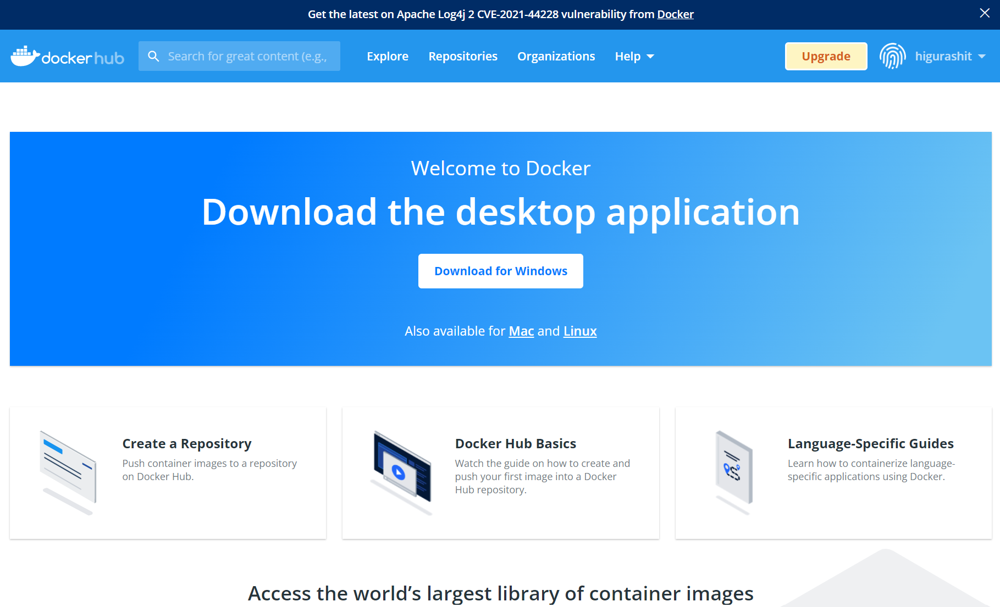
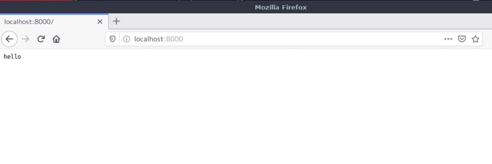
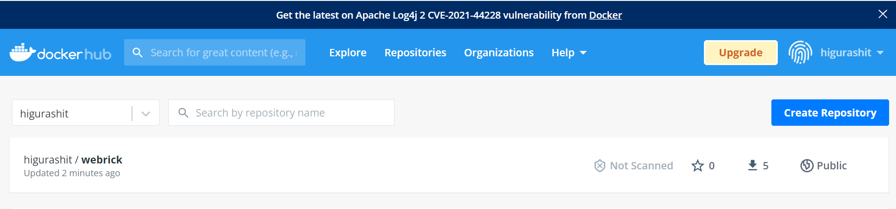

# Docker について

## Docker, Docker Compose のインストールまで

[WorkSpaces について](./amazon-workspaces.md) を参照

## チュートリアルの実施

[この Qiita](https://qiita.com/zembutsu/items/24558f9d0d254e33088f) や [公式サイト(日本語)](https://docs.docker.jp/get-started/index.html) を参照

- hello-world

  - `docker run hello-world`
  - `docker image ls`

- bulletinborad

  - `mkdir MyProject`
  - `cd MyProject`
  - `git clone https://github.com/dockersamples/node-bulletin-board`
  - `cd node-bulletin-board`
  - `ls -l`
  - `cd bulletin-board-app`
  - `cat Dockerfile`

    ```
    FROM node:current-slim

    WORKDIR /usr/src/app
    COPY package.json .
    RUN npm install

    EXPOSE 8080
    CMD [ "npm", "start" ]

    COPY . .
    ```

  - `docker build --tag bulletinboard:1.0 .`

    - エラー発生…  
      `request to https://registry.npmjs.org/body-parser failed, reason: getaddrinfo EAI_AGAIN registry.npmjs.org`
    - DockerFile に DNS 設定を入れれば OK

    ```
    FROM node:current-slim

    WORKDIR /usr/src/app
    COPY package.json .
    RUN echo 'nameserver 8.8.8.8' >> /etc/resolv.conf && \
      npm install

    EXPOSE 8080
    CMD [ "npm", "start" ]

    COPY . .

    ```

  - docker run --publish 8000:8080 --detach --name bb bulletinboard:1.0
  - docker rm --force bb

- hello-next

  - Dockerfile
    ```
    FROM node:14.17.0
    WORKDIR /usr/src/app
    ```
  - docker-compose.yml

    ```
    version: '3'
    services:
      app:
        build:
          context: .
          dockerfile: Dockerfile
        volumes:
          - ./:/usr/src/app
        command: sh -c "cd hello-next && npm run dev"
        ports:
          - "3000:3000"

    ```

  - `docker-compose run --rm app npm install create-next-app`

    - 同様のエラーが発生…

      ```
      npm ERR! code EAI_AGAIN
      npm ERR! errno EAI_AGAIN
      npm ERR! request to https://registry.npmjs.org/create-next-app failed, reason: getaddrinfo EAI_AGAIN registry.npmjs.org

      npm ERR! A complete log of this run can be found in:
      npm ERR!     /root/.npm/_logs/2022-01-07T05_39_01_804Z-debug.log
      ERROR: 1

      ```

  - [このサイト](https://ondwn.com/blog-20190512/) を見ると、Docker の DNS 設定を docker-compose.yml で行うと良い（下記 dns ディレクティブ）

    ```
    version: '3'
    services:
      app:
        dns: 8.8.8.8 # add this line
        build:
          context: .
          dockerfile: Dockerfile
        volumes:
          - ./:/usr/src/app
        command: sh -c "cd hello-next && npm run dev"
        ports:
          - "3000:3000"

    ```

  - 無事に npm コマンドが実行できた
  - `docker-compose run --rm app npm install create-next-app`

    ```
    Creating hellonext_app_run ... done
    npm WARN saveError ENOENT: no such file or directory, open '/usr/src/app/package.json'
    npm WARN enoent ENOENT: no such file or directory, open '/usr/src/app/package.json'
    npm WARN app No description
    npm WARN app No repository field.
    npm WARN app No README data
    npm WARN app No license field.

    + create-next-app@12.0.7
    updated 1 package and audited 1 package in 1.061s
    found 0 vulnerabilities

    ```

## DockerHub のアカウント作成、ログイン

- DockerHub アカウントの作成
  - 普通に作成
    
- DockerHub へのログイン（プロンプト）

  - `docker login`

    - UserName はメールアドレスじゃなくユーザ名なので注意

    ```
    [TEC\higurashit@a-3mpaoy5w8ussf MyProject]$ docker login
    Login with your Docker ID to push and pull images from Docker Hub. If you don't have a Docker ID, head over to https://hub.docker.com to create one.
    Username: higurashit
    Password:
    WARNING! Your password will be stored unencrypted in /home/higurashit/.docker/config.json.
    Configure a credential helper to remove this warning. See
    https://docs.docker.com/engine/reference/commandline/login/#credentials-store

    Login Succeeded
    ```

## サンプルコードの作成と実行

https://www.youtube.com/watch?v=lZD1MIHwMBY

```
[私は名前がありません!@a-3mpaoy5w8ussf ruby]$ ls -l
合計 8
-rw-r--r-- 1 TEC\higurashit TEC\domain users 117 1 月 13 02:03 Dockerfile
-rw-r--r-- 1 TEC\higurashit TEC\domain users 193 1 月 13 02:00 main.rb

[私は名前がありません!@a-3mpaoy5w8ussf ruby]$ cat Dockerfile
# Dockerfile is base image
FROM ruby:2.7

RUN mkdir /var/www
COPY main.rb /var/www

CMD ["ruby", "/var/www/main.rb"]
[私は名前がありません!@a-3mpaoy5w8ussf ruby]$ cat main.rb
require 'webrick'

server = WEBrick::HTTPServer.new(
  DocumentRoot: './',
  BindAddress: '0.0.0.0',
  Port: 8000
)

server.mount_proc('/') do |req, res|
  res.body = 'hello'
end

server.start


# docker image の作成（タグ付き、現在フォルダ）
[私は名前がありません!@a-3mpaoy5w8ussf ruby]$ docker image build -t sample/webrick:latest .
Sending build context to Docker daemon 3.072kB
Step 1/4 : FROM ruby:2.7
2.7: Pulling from library/ruby
0e29546d541c: Pull complete
9b829c73b52b: Pull complete
cb5b7ae36172: Pull complete
6494e4811622: Pull complete
6f9f74896dfa: Pull complete
8692434624fe: Pull complete
8d32960c290d: Pull complete
8a33cab82451: Pull complete
Digest: sha256:7667608a9fc0ec9ee434a1957f21e981ccdde4b60c2c3d86b19cf87e4d300f70
Status: Downloaded newer image for ruby:2.7
---> c6d24c46376e
Step 2/4 : RUN mkdir /var/www
---> Running in 19811bfeebf7
Removing intermediate container 19811bfeebf7
---> 5a8d024f025b
Step 3/4 : COPY main.rb /var/www
---> 02a8f1a87e98
Step 4/4 : CMD ["ruby", "/var/www/main.rb"]
---> Running in 40feb5b82036
Removing intermediate container 40feb5b82036
---> 57bbfbf3223c
Successfully built 57bbfbf3223c
Successfully tagged sample/webrick:latest
[私は名前がありません!@a-3mpaoy5w8ussf ruby]$

[私は名前がありません!@a-3mpaoy5w8ussf ruby]$ docker image ls
REPOSITORY       TAG            IMAGE ID       CREATED          SIZE
sample/webrick   latest         57bbfbf3223c   15 seconds ago   864MB
<none>           <none>         1189830cfa80   6 hours ago      243MB
hellonext_app    latest         15dd49ef9e24   5 days ago       943MB
ruby             2.7            c6d24c46376e   3 weeks ago      864MB
node             current-slim   a6a0d486ccb2   3 weeks ago      243MB
hello-world      latest         feb5d9fea6a5   3 months ago     13.3kB
node             14.17.0        9153ee3e2ced   8 months ago     943MB
[私は名前がありません!@a-3mpaoy5w8ussf ruby]$

# dockerのコンテナ作成と起動を同時に行う
  # ポートは自身の8000番とDocker側の8000を紐付ける
  # コンテナには名前をつけると便利
  # イメージ名はsample/webrickを指定
[私は名前がありません!@a-3mpaoy5w8ussf ruby]$ docker container run -p 8000:8000 --name webrick sample/webrick:latest
[2022-01-12 17:08:07] INFO  WEBrick 1.6.1
[2022-01-12 17:08:07] INFO  ruby 2.7.5 (2021-11-24) [x86_64-linux]
[2022-01-12 17:08:07] INFO  WEBrick::HTTPServer#start: pid=1 port=8000
```

Web サーバが立ち上がっていることを確認


Docker コンテナの停止と削除

```
# Ctrl + C で終了
[私は名前がありません!@a-3mpaoy5w8ussf ruby]$ docker container ls
CONTAINER ID   IMAGE     COMMAND   CREATED   STATUS    PORTS     NAMES
[私は名前がありません!@a-3mpaoy5w8ussf ruby]$ docker container ls -a
CONTAINER ID   IMAGE                   COMMAND                  CREATED         STATUS                          PORTS     NAMES
25add346d2b5   sample/webrick:latest   "ruby /var/www/main.…"   4 minutes ago   Exited (1) About a minute ago             webrick
962dedb65d00   hello-world             "/hello"                 6 hours ago     Exited (0) 6 hours ago                    vigilant_einstein
abbf6418e6c2   hello-world             "-d"                     6 hours ago     Created                                   jolly_volhard
f6f11432a438   hello-world             "/hello"                 6 hours ago     Exited (0) 6 hours ago                    competent_carson
02e50c333103   1189830cfa80            "/bin/sh -c 'npm ins…"   6 hours ago     Exited (1) 6 hours ago                    sleepy_rubin
58ba8207c450   node:14.17.0            "docker-entrypoint.s…"   5 days ago      Exited (0) 5 days ago                     sharp_poincare
f02c97cc986e   2775383925ee            "/bin/sh -c 'npm ins…"   7 days ago      Exited (1) 7 days ago                     vibrant_williams
891f65025329   hello-world             "/hello"                 7 days ago      Exited (0) 7 days ago                     dreamy_tereshkova
[私は名前がありません!@a-3mpaoy5w8ussf ruby]$

# 停止と削除
[私は名前がありません!@a-3mpaoy5w8ussf ruby]$ docker container stop webrick
webrick
[私は名前がありません!@a-3mpaoy5w8ussf ruby]$ docker container rm webrick
webrick
[私は名前がありません!@a-3mpaoy5w8ussf ruby]$ docker container ls -a
CONTAINER ID   IMAGE          COMMAND                  CREATED       STATUS                   PORTS     NAMES
962dedb65d00   hello-world    "/hello"                 6 hours ago   Exited (0) 6 hours ago             vigilant_einstein
abbf6418e6c2   hello-world    "-d"                     6 hours ago   Created                            jolly_volhard
f6f11432a438   hello-world    "/hello"                 6 hours ago   Exited (0) 6 hours ago             competent_carson
02e50c333103   1189830cfa80   "/bin/sh -c 'npm ins…"   6 hours ago   Exited (1) 6 hours ago             sleepy_rubin
58ba8207c450   node:14.17.0   "docker-entrypoint.s…"   5 days ago    Exited (0) 5 days ago              sharp_poincare
f02c97cc986e   2775383925ee   "/bin/sh -c 'npm ins…"   7 days ago    Exited (1) 7 days ago              vibrant_williams
891f65025329   hello-world    "/hello"                 7 days ago    Exited (0) 7 days ago              dreamy_tereshkova
[私は名前がありません!@a-3mpaoy5w8ussf ruby]$

```

よく使うコマンド
１．ログ

```
# Webサーバをバックグラウンド実行
[私は名前がありません!@a-3mpaoy5w8ussf ruby]$ docker container run -d -p 8000:8000 --name webrick sample/webrick:latest
049550e2086211f89ebd378ab27b68a46fa9ced5f556c23dc29ade6b97d09a3f
[私は名前がありません!@a-3mpaoy5w8ussf ruby]$ docker container ls
CONTAINER ID   IMAGE                   COMMAND                  CREATED          STATUS          PORTS                                       NAMES
049550e20862   sample/webrick:latest   "ruby /var/www/main.…"   10 seconds ago   Up 10 seconds   0.0.0.0:8000->8000/tcp, :::8000->8000/tcp   webrick
[私は名前がありません!@a-3mpaoy5w8ussf ruby]$

# ブラウザでアクセス後、ログを確認
[私は名前がありません!@a-3mpaoy5w8ussf ruby]$ docker container logs webrick
[2022-01-12 17:17:39] INFO  WEBrick 1.6.1
[2022-01-12 17:17:39] INFO  ruby 2.7.5 (2021-11-24) [x86_64-linux]
[2022-01-12 17:17:39] INFO  WEBrick::HTTPServer#start: pid=1 port=8000
172.17.0.1 - - [12/Jan/2022:17:18:11 UTC] "GET / HTTP/1.1" 200 5
- -> /
[私は名前がありません!@a-3mpaoy5w8ussf ruby]$

```

２．別のコマンドを実行

```
[私は名前がありません!@a-3mpaoy5w8ussf ruby]$ docker container exec webrick ruby -v
ruby 2.7.5p203 (2021-11-24 revision f69aeb8314) [x86_64-linux]
[私は名前がありません!@a-3mpaoy5w8ussf ruby]$

```

３．後片付け

```
[私は名前がありません!@a-3mpaoy5w8ussf ruby]$ docker container ls -a
CONTAINER ID   IMAGE                   COMMAND                  CREATED         STATUS                   PORTS                                       NAMES
049550e20862   sample/webrick:latest   "ruby /var/www/main.…"   2 minutes ago   Up 2 minutes             0.0.0.0:8000->8000/tcp, :::8000->8000/tcp   webrick
962dedb65d00   hello-world             "/hello"                 6 hours ago     Exited (0) 6 hours ago                                               vigilant_einstein
abbf6418e6c2   hello-world             "-d"                     6 hours ago     Created                                                              jolly_volhard
f6f11432a438   hello-world             "/hello"                 6 hours ago     Exited (0) 6 hours ago                                               competent_carson
02e50c333103   1189830cfa80            "/bin/sh -c 'npm ins…"   6 hours ago     Exited (1) 6 hours ago                                               sleepy_rubin
58ba8207c450   node:14.17.0            "docker-entrypoint.s…"   5 days ago      Exited (0) 5 days ago                                                sharp_poincare
f02c97cc986e   2775383925ee            "/bin/sh -c 'npm ins…"   7 days ago      Exited (1) 7 days ago                                                vibrant_williams
891f65025329   hello-world             "/hello"                 7 days ago      Exited (0) 7 days ago                                                dreamy_tereshkova
[私は名前がありません!@a-3mpaoy5w8ussf ruby]$ docker system prune -a
WARNING! This will remove:
  - all stopped containers
  - all networks not used by at least one container
  - all images without at least one container associated to them
  - all build cache

Are you sure you want to continue? [y/N] y
Deleted Containers:
962dedb65d00a833b7c10ba3e2cc395d53a51a1bd54e6226e33977206c196e3c
abbf6418e6c217240e708633e99d8bafe3881d9679d1657e2785bb9da7a30bd5
f6f11432a43858614180e26e082fe6b4be65e3fb0d3696c5b664a7498dd920e0
02e50c333103b4c293c6745d2ac9c7163298ccfc44a1295cab78a94c1134d4c1
58ba8207c450f2b8eb96ad4398e9e4a113a57a1971a51731fc619b7ce35520f9
f02c97cc986e54c72281855d192d7b97131cd50fce776712cb4200eadfabe37f
891f65025329030fcdbd1164d494a45361b5cd99c9cf1978c0365d672a194da4

Deleted Networks:
hellonext_default

Deleted Images:
untagged: hellonext_app:latest
deleted: sha256:15dd49ef9e2499ca6fe72c074bc65769eb435fd6c554be273b33f0ae6a95847a
deleted: sha256:197e0d7f930b3ac2f1e75e2daa54c971a8a39e1436f2688bf06073e9f89dacee
untagged: node:current-slim
untagged: node@sha256:8f8a97163bed5b292bcd7a92a96849ef7a4c1fc2b105b5579dff258307de25fe
untagged: node:14.17.0
untagged: node@sha256:af9879e7473d347048c5d5919aa9775f27c33d92e4d58058ffdc08247f4bd902
deleted: sha256:9153ee3e2ced316fb30612aa14f7b787711e94ca65afa452af9ca9b79574dce3
deleted: sha256:3d2a7864763f2d31cc8b03b53b4eb3e992011ebbd5b4079d452fc9f56e94ec08
deleted: sha256:96fde5ea91cdd20740590e65941b4a0de6e0d6cc4fc40a78589c668a3b85ecd1
deleted: sha256:d0cba0d348e6825119f752b60adcdcb4801764fab5ed9bebbc5ff8f482707b0c
deleted: sha256:a0153172017a08a521a8be971ca4dcb5fbc4b7227642c12bbb2da6265bd66b50
deleted: sha256:f1123940e954d335d91b52a40fab4f8144f38ff113ade7d65663071d0f06da6f
deleted: sha256:f1f4fbb0e7e6e0ce2d9eae1e577f9f6df0a719dd874bff00b2d08895c75c297d
deleted: sha256:1eb455ab6d45fdbbd90fccff791ffa228080c052acf464f8da1b1d78650bd706
deleted: sha256:1dbe832a694971a925d7d216f49b700c95f402bd72288f9d37eceb1d59dcf72d
deleted: sha256:2f4ee6a2e1b5dfb9236cd262e788f9d39109242ca27a4aacb583c8af66ec3ff7
untagged: ruby:2.7
untagged: ruby@sha256:7667608a9fc0ec9ee434a1957f21e981ccdde4b60c2c3d86b19cf87e4d300f70
deleted: sha256:1189830cfa804418e1f9fba07f3a44f6036744be02c58f5b05d0831a71226737
deleted: sha256:2775383925eeda9e67b06d29157c0c60195ba5a0f385a711187696ec20d2a061
deleted: sha256:44833022d87518e606640eddc0eb935f682006e529d791bbd7e12e8ba4da7916
deleted: sha256:d878c235d61a77495cc76c8b860381f2c02555ab729df3a7e693f93c97c77726
deleted: sha256:578b14ecdfd16d833902416e9338885beab2a688d9da12b1c855a8aac3540ac3
deleted: sha256:a6a0d486ccb24e735ec3f03d2e338a064ad2bf4946e9cbac1e3f0a73e4a59dae
deleted: sha256:bece7216d8178337911c415b8a538edea4fecf7d7b46b1e7ca9dadba0ed899c3
deleted: sha256:217dfc1c2626348a2dd31efa530f58137d985f9bd690c529d33c202050133426
deleted: sha256:b26f236e8a2d986e04fcc5102f8ec014ca5c9c71ec40755d379066f3301d125a
deleted: sha256:125064e9c15ca1490805e195b9dc6672b31c3b7bb7f0f2e43a833826fd54635f
deleted: sha256:2edcec3590a4ec7f40cf0743c15d78fb39d8326bc029073b41ef9727da6c851f
untagged: hello-world:latest
untagged: hello-world@sha256:2498fce14358aa50ead0cc6c19990fc6ff866ce72aeb5546e1d59caac3d0d60f
deleted: sha256:feb5d9fea6a5e9606aa995e879d862b825965ba48de054caab5ef356dc6b3412
deleted: sha256:e07ee1baac5fae6a26f30cabfe54a36d3402f96afda318fe0a96cec4ca393359

Total reclaimed space: 1.186GB
[私は名前がありません!@a-3mpaoy5w8ussf ruby]$ docker container ls -a
CONTAINER ID   IMAGE                   COMMAND                  CREATED         STATUS         PORTS                                       NAMES
049550e20862   sample/webrick:latest   "ruby /var/www/main.…"   2 minutes ago   Up 2 minutes   0.0.0.0:8000->8000/tcp, :::8000->8000/tcp   webrick
[私は名前がありません!@a-3mpaoy5w8ussf ruby]$

```

## DockerHub への Push

https://www.youtube.com/watch?v=fdQ7MmQNTa0

```
[私は名前がありません!@a-3mpaoy5w8ussf ruby]$ docker images
REPOSITORY       TAG       IMAGE ID       CREATED          SIZE
sample/webrick   latest    57bbfbf3223c   18 minutes ago   864MB

[私は名前がありません!@a-3mpaoy5w8ussf ruby]$ docker run -it -d sample/webrick
cab8fc7837aaa77d02f978a2c9c052fafca42119e4a446162b6f0c8546e9996c

[私は名前がありません!@a-3mpaoy5w8ussf ruby]$ docker ps -a
CONTAINER ID   IMAGE            COMMAND                  CREATED          STATUS          PORTS     NAMES
cab8fc7837aa   sample/webrick   "ruby /var/www/main.…"   18 seconds ago   Up 18 seconds             frosty_black

[私は名前がありません!@a-3mpaoy5w8ussf ruby]$ docker exec -it cab8fc7837aa bash
root@cab8fc7837aa:/# ls
bin  boot  dev	etc  home  lib	lib64  media  mnt  opt	proc  root  run  sbin  srv  sys  tmp  usr  var
root@cab8fc7837aa:/#
exit

[私は名前がありません!@a-3mpaoy5w8ussf ruby]$ docker commit cab8fc7837aa higurashit/webrick:2
sha256:3266808c2fb2838ec156dc11cf04c6327f8ba393c9c1bccdf9e6aa8269b52f18

[私は名前がありません!@a-3mpaoy5w8ussf ruby]$ docker images
REPOSITORY           TAG       IMAGE ID       CREATED          SIZE
higurashit/webrick   2         3266808c2fb2   4 seconds ago    864MB
sample/webrick       latest    57bbfbf3223c   22 minutes ago   864MB

[私は名前がありません!@a-3mpaoy5w8ussf ruby]$ docker push higurashit/webrick:2
The push refers to repository [docker.io/higurashit/webrick]
b4c3218a01b8: Pushed
43492cebeaf1: Pushed
dbf69d84b23b: Pushed
bcc3a1bcda09: Mounted from library/ruby
070789d5d84c: Mounted from library/ruby
969024b80c52: Mounted from library/ruby
c3a0d593ed24: Mounted from library/ruby
26a504e63be4: Mounted from library/ruby
8bf42db0de72: Mounted from library/ruby
31892cc314cb: Mounted from library/ruby
11936051f93b: Mounted from library/ruby
2: digest: sha256:c8a508c531bcf00ad75aba3b2ebb40d5dd7dd037c5e928e5a0a8f22150ddfac4 size: 2624
[私は名前がありません!@a-3mpaoy5w8ussf ruby]$

```

DockerHub に登録される


## その他の Tips

- alias の設定（コマンドを短くするために）
  ```
  vi ~/.bashrc
  # 以下を追加
  alias d='docker'
  alias dc='docker-compose'
  alias dc_alldelete='docker-compose down --rmi all --volumes --remove-orphans'
  ```
- docker グループへの追加（docker コマンドを自分のユーザで実行するために）
  ```
  sudo gpasswd -a $USER docker
  systemctl restart docker
  ```
- 起動したコンテナに入るにはいくつかの条件が必要
  - `docker run -it` でコンテナを作成していること
  - `docker run -it` コマンド後にエラーが起きないこと
- 基本的な docker コマンド
  - docker run
    - コンテナの作成（一番大事）
    - -it をつけて入れるようにする、name をつける、dns をつけるなど必要なものは run に集約する
    - `docker run [OPTIONS] IMAGE [COMMAND] [ARG...]`
    - `docker run -it --dns=8.8.8.8 --name=mynodejs node:16.14.0-alpine`
  - docker ps -a
    - 停止中含めてコンテナを表示
  - docker rename
    - 名前を変更できる
    - `docker rename 旧 新`
    - `docker rename boring_bouman mynextjs`
  - docker start
    - 停止中の docker を起動（docker run 時に -it オプションがついていて、エラーが起きないと起動したままになる）
  - docker attach
    - 起動中の docker に入る
  - （docker に入っている時に）Ctrl + P → Q
    - 起動中の docker から出る
  - docker rm
    - コンテナの削除
  - docker inspect
    - コンテナのレイヤ情報を表示
- docker で try & error する場合
  - 何度も入力するものは定義してしまう
  ```
  # ~/mynodejs.source
  DEFAULT_OPTIONS="--dns=8.8.8.8"
  CONTAINER_NAME=mynodejs
  NODEJS_IMAGE=node:17.6.0-alpine
  ```
  - 実行時
    - `docker run -it $DEFAULT_OPTIONS --name=$CONTAINER_NAME $NODEJS_IMAGE`
- alpine について
  - 最小構成の alpine は bash が使えないなど課題がある
  - [ここ](https://www.creationline.com/lab/29422)に書いてあるとおり、小さくても slim にするべき（制約が出てから考える）
- docker 上の動作確認 ①
  - ［HOST］ `d run -it --name=nextjs-app --dns=8.8.8.8 node:17.6.0 /bin/bash`
    - -it オプションをつけて標準出力を表示＋対話モードに
    - --name オプションをつけてコンテナ名を指定（ただし、コンテナを消さない限り同じ name では作れない）
    - --dns オプションをつけて npm が動作しない事象を解消
    - docker image は node のフルバージョン（alpine, slim は避ける）
    - /bin/bash で bash から始める
  - ［CONTAINER］/ から始まる
  - ［CONTAINER］フォルダ移動
  - ［CONTAINER］`npm i -g npm@8.5.2`
  - ［CONTAINER］Ctrl + P → Q でデタッチ
  - ［HOST］`d attach nextjs-app`
  - ［CONAINER］移動後のフォルダから始まり、npm バージョンも 8.5.2 に上がっている
  - ［CONTAINER］Ctrl + D でログアウト
  - ［HOST］`d start nextjs-app`
  - ［HOST］`d attach nextjs-app`
  - ［CONAINER］フォルダは / だが、npm バージョンは 8.5.2 に上がったまま
- docker 上の動作確認 ②
  - ［HOST］ `d run -it --name=nextjs-app --dns=8.8.8.8 --volume=$PWD:/usr/local/src/app --workdir=/usr/local/src node:17.6.0 /bin/bash`
    - --volume(-v)オプション で HOST とファイルを共有
    - --workdir(-w)オプション で 作業ディレクトリを指定
  - ［CONTAINER］/usr/local/src から始まる
  - ［CONTAINER］/usr/local/src/app が作成されていて、Dockerfile 等が入っている
  - ［CONTAINER］ファイルの作成
  - ［CONTAINER］Ctrl + P → Q でデタッチ
  - ［HOST］CONTAINER で作成されたファイルが存在する（root で作成されている）
  - ［HOST］コンテナを削除
  - ［HOST］CONTAINER で作成されたファイルは存在したまま
- docker 上の動作確認 ③
  - ［HOST］ `d run --rm -it --name=nextjs-app --dns=8.8.8.8 --volume=$PWD:/usr/local/src/app --workdir=/usr/local/src node:17.6.0 /bin/bash`
    - --rm オプションをつけてコンテナの終了時にコンテナを削除する
  - ［CONTAINER］/usr/local/src から始まる
  - ［CONTAINER］/ にフォルダ移動
  - ［CONTAINER］Ctrl + P → Q でデタッチ
  - ［HOST］`d attach nextjs-app`
  - ［CONTAINER］/ にいる
  - ［CONTAINER］Ctrl + D でログアウト（コンテナの終了）
  - ［HOST］`d ps -a` をするとコンテナが削除されている
  - （補足）Ctrl + P → Q でデタッチした後も、`d stop nextjs-app` をするとコンテナが削除されている
- docker 上の動作確認 ③

  - ［HOST］ `d run --rm -it --name=nextjs-app --dns=8.8.8.8 --volume=$PWD:/usr/local/src/app --workdir=/usr/local/src --user=node node:17.6.0 /bin/bash`
    - --user(-u)オプションをつけてユーザ名を指定
  - ［CONTAINER］/usr/local/src から始まる
  - ［CONTAINER］echo $PORT で 3000 を確認
  - ［CONTAINER］/usr/local/src/app にファイルを作成しようとしたら作成できない（権限なし）
    - app ディレクトリの権限はグループ：69139, ユーザ 66049 で 775
  - ［CONTAINER］/home/node が存在する
    - `--volume=$PWD:/home/node/app --workdir=/home/node` に変更して再実行
  - ［HOST］ `d run --rm -it --name=nextjs-app --dns=8.8.8.8 --volume=$PWD:/home/node/app --workdir=/home/node --user=node node:17.6.0 /bin/bash`
  - ［CONTAINER］/home/node/app にファイルを作成しようとしたら作成できない（権限なし）
    - app ディレクトリの権限はグループ：69139, ユーザ 66049 で 775
  - ［CONTAINER］/home/node にファイルを作成しようとしたら OK
    - `--volume=$PWD:/home/node` に変更して再実行
  - ［HOST］ `d run --rm -it --name=nextjs-app --dns=8.8.8.8 --volume=$PWD:/home/node --workdir=/home/node --user=node node:17.6.0 /bin/bash`
  - ［CONTAINER］/home/node にファイルを作成しようとしたら作成できない（権限なし）
    - node ディレクトリの権限はグループ：69139, ユーザ 66049 で 775 ...
    - [ここ](https://qiita.com/yohm/items/047b2e68d008ebb0f001)を見てホストのユーザ、PW を共有するように設定
    - 作業ディレクトリも全部 $PWD 系にしてすっきりさせる
  - ［HOST］ `d run --rm -it --name=nextjs-app --dns=8.8.8.8 --volume=$PWD:$PWD --volume=/etc/group:/etc/group:ro --volume=/etc/passwd:/etc/passwd:ro --workdir=$PWD --user=$(id -u $USER):$(id -g $USER) node:17.6.0 /bin/bash`
    - --volume その 1: ディレクトリ構成を一緒に（ここまでしなくてもよい）
    - --volume その 2, 3: group と passwd を Read Only で共有
    - --workdir: 現在のディレクトリ
    - --user: 現在のユーザ、グループを設定
  - ［CONTAINER］HOST の現在のディレクトリと同一階層から始まる
    - TODO: I have no name! を変えたい（Workplaces じゃなければ大丈夫かも）
    - TODO: プロンプトの表示がフルパスになっているので、変えたい
      - PS1="${debian_chroot:+($debian_chroot)}\u@\h:\W\$ "
  - ［CONTAINER］ファイルを作成
  - ［CONTAINER］ls で確認すると、自分のユーザ、グループになっている
  - ［CONTAINER］Ctrl + P → Q でデタッチ
  - ［HOST］rm で削除できる
  - ［HOST］ファイルを作成
  - ［HOST］`d attach nextjs-app`
  - ［CONTAINER］rm で削除できる
  - ［CONTAINER］yarn コマンドが実行できない（/.cache/への権限エラー）

- docker 上の動作確認 ④
  - ［HOST］ `d run --rm -it --name=nextjs-app --dns=8.8.8.8 --volume=$PWD:/root --volume=/etc/group:/etc/group:ro --volume=/etc/passwd:/etc/passwd:ro --workdir=/root --env="PORT=3000" --publish=8080:3000 --user=root:root node:17.6.0 /bin/bash`
    - root で実行する
    - --env(-e) オプションをつけて環境変数を定義
    - --publish-all(-p)オプションをつけてホストとコンテナのポートをマッピング
  - ［CONTAINER］yarn コマンドが実行できた
  - ［CONTAINER］nextjs の yarn dev コマンドも正常に実行できた
  - ［HOST］Firefox で localhost:8080 にアクセスすると、nextjs が表示された
