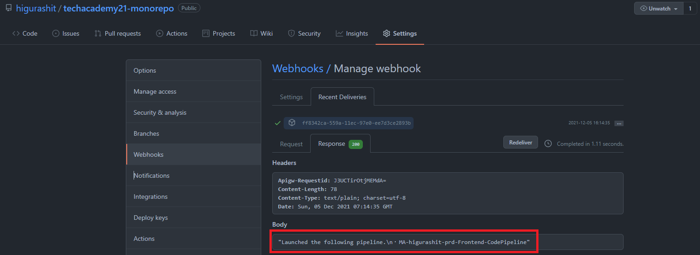
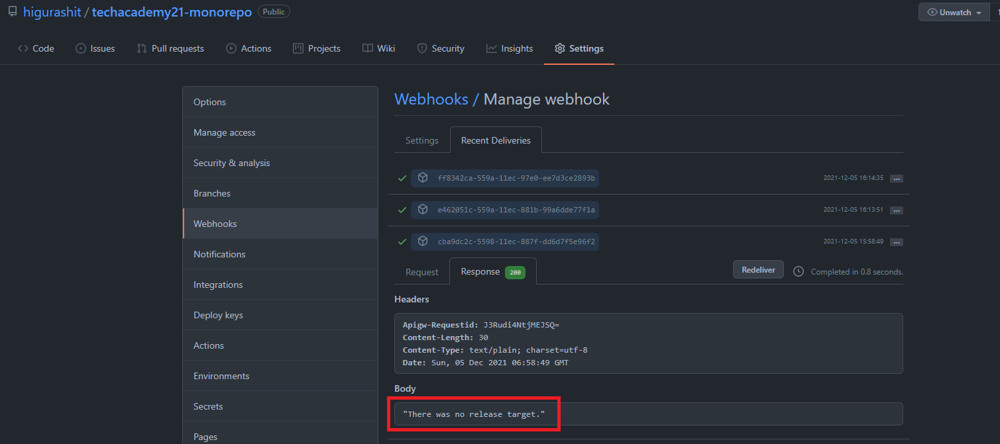
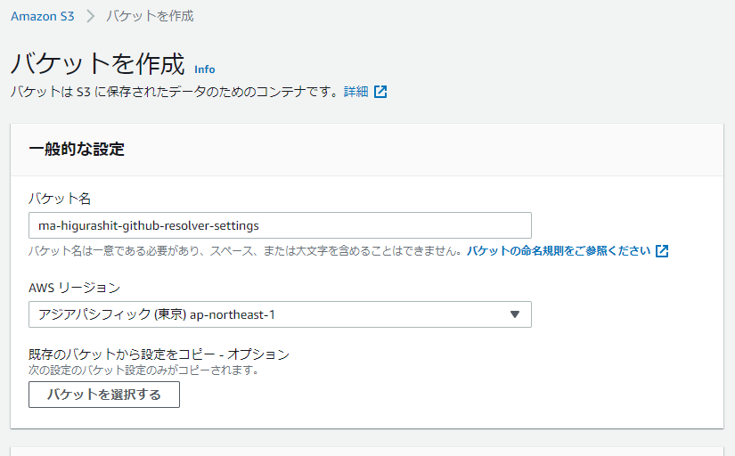
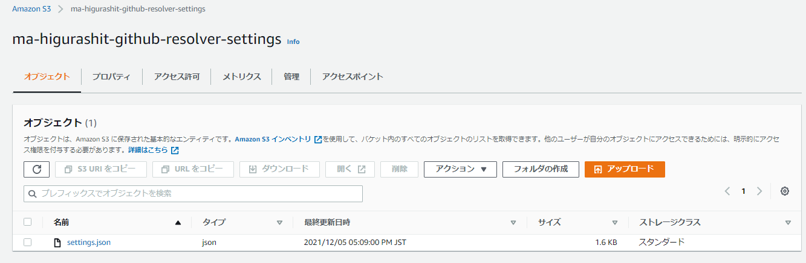

# Monorepo と Multirepo

[Back to Top](./index.md)

## Multirepo とは<sup>[1]</sup>

- サービスやライブラリを複数のリポジトリで管理する方法
- Amazon、Netflix は multi-repo パターンである

---

## Monorepo とは<sup>[2]</sup>

- すべてのサービスやライブラリを単一のリポジトリで管理する方法
- Google、Dropbox、Facebook、Twitter は mono-repo パターンである

---

## AWS × Multirepo での CI/CD パイプライン構成

## 

## AWS × Monorepo での CI/CD パイプライン構成

[この記事](https://aws.amazon.com/jp/blogs/news/integrate-github-monorepo-with-aws-codepipeline-to-run-project-specific-ci-cd-pipelines/)を参考に構築する  


---

# 実装内容（AWS × Monorepo）(2021/10/20 ~)

## 空の Lambda 関数の作成(2021/10/20)

東京リージョンで行う。  
デフォルト設定で`MA-higurashit-github-resolver`関数を作成。（言語は nodejs14、権限はデフォルト）  
GitHub webhook の中身を確認できるよう、event をログに出力する。

```javascript
exports.handler = async (event) => {
  console.log({ event }); // 追記

  // TODO implement
  const response = {
    statusCode: 200,
    body: JSON.stringify('Hello from Lambda!'),
  };
  return response;
};
```

Deploy して Test を行う。（テストイベントは API Gateway AWS Proxy）  
正常に動作することを確認。（Lambda）

---

## API Gateway の作成(2021/10/20)

東京リージョンで行う。  
HTTP API の`MA-higurashit-github-resolver`を作成。  
作成した Lambda を統合し、POST メソッドのみ作成する。  
`$default`ステージのエンドポイントが払い出されるので、`https://[api-id].execute-api.ap-northeast-1.amazonaws.com/MA-higurashit-github-resolver`をコピーする。  
Postman で POST リクエストを送り、正常に動作することを確認。（API Gateway → Lambda）

---

## GitHub の Webhook 設定(2021/10/20)

[ここ](https://github.com/higurashit/techacademy21-monorepo/settings/hooks/new)から Webhook を追加する

- Payload URL に API Gateway のエンドポイントを指定する。
- Content type は[この記事](https://aws.amazon.com/jp/blogs/news/integrate-github-monorepo-with-aws-codepipeline-to-run-project-specific-ci-cd-pipelines/)を参考に`application/json`を選択する。
- SSL verification は`Enable SSL verification`を選択（デフォルト）
- 「Which events would you like to trigger this webhook?」は`Just the push event`を選択（デフォルト）
- `Active`にチェックを入れて`Add Webhook`ボタンを押す
- （セキュリティ対応）Secret を設定することで認証が可能

---

## GitHub Webhook の動作テスト(2021/10/20)

- 試しに Push をしてみる
- GitHub の Webhook 結果が 404(Not Found)に
  - POST メソッドであることは OK
  - エンドポイント誤り（統合リソースをつけていなかった）
- 再実行したところ、GitHub の Webhook 結果が 200 に
- Lambda で GitHub の Push イベントの中身が取得できた

```text
2021-10-20T14:38:31.259Z	37ab47c7-f098-4e2b-bd95-384d0cfcd189	INFO	{
  event: {
    version: '2.0',
    routeKey: 'POST /MA-higurashit-github-resolver',
    rawPath: '/MA-higurashit-github-resolver',
    rawQueryString: '',
    headers: {
      accept: '*/*',
      'content-length': '8229',
      'content-type': 'application/json',
      host: '2anno3qpm4.execute-api.ap-northeast-1.amazonaws.com',
      'user-agent': 'GitHub-Hookshot/4b2bd9b',
      'x-amzn-trace-id': 'Root=1-617029e7-23847afe1bce159818acc9cd',
      'x-forwarded-for': '140.82.115.117',
      'x-forwarded-port': '443',
      'x-forwarded-proto': 'https',
      'x-github-delivery': '64c037c6-31b3-11ec-9eec-9188c7032d27',
      'x-github-event': 'push',
      'x-github-hook-id': '324313051',
      'x-github-hook-installation-target-id': '417163176',
      'x-github-hook-installation-target-type': 'repository'
    },
    requestContext: {
      accountId: '626394096352',
      apiId: '2anno3qpm4',
      domainName: '2anno3qpm4.execute-api.ap-northeast-1.amazonaws.com',
      domainPrefix: '2anno3qpm4',
      http: [Object],
      requestId: 'Hgt8JhGntjMEJMQ=',
      routeKey: 'POST /MA-higurashit-github-resolver',
      stage: '$default',
      time: '20/Oct/2021:14:38:31 +0000',
      timeEpoch: 1634740711188
    },
    body: '{ ~ 省略(8Kbyte) ~}',
    isBase64Encoded: false
  }
}
```

body の中身を確認するとコミット情報などが取得できることを確認。（GitHub→API Gateway→Lambda）


---

## event の各要素(2021/10/20)

| プロパティ名                   | 格納されている値          | 例                                                             |
| ------------------------------ | ------------------------- | -------------------------------------------------------------- |
| event.body.repositry.full_name | アカウント名/リポジトリ名 | higurashit/techacademy21-monorepo                              |
| event.body.ref                 | 更新ブランチ名            | refs/heads/master                                              |
| event.body.commits             | 各コミットごとの更新情報  | コミットごとに added, removed, modified にパスが格納 ※下記参照 |

```
event
　└ body(JSON format)
　　　├ commits[0]
　　　│　├ added:    [0] => docs/hoge.md, [1] => docs/fuga.md
　　　│　├ removed:  [0] => docs/hoge2.md, [1] => docs/fuga2.md
　　　│　└ modified: [0] => docs/hoge3.md, [1] => docs/fuga3.md
　　　├ commits[1]
　　　│　└ …
　　　├ commits[2]
　　　│　└ …
```

---

## Lambda 関数による更新対象の抽出(2021/10/20 ~ 2021/12/5)

メイン処理は以下の通り

- S3 から起動パイプラインの設定を取得
- GitHub Webhook の内容からリポジトリとブランチを取得
- GitHub Webhook の情報を元に起動が必要なパイプラインを判定
- パイプラインの起動
- GitHub に起動対象のパイプライン名を返却

```javascript
// メイン処理
exports.handler = async (event) => {
  console.log({ event });

  // S3 から起動パイプラインの設定を取得
  const settings = await getSettingsFromS3();

  // GitHub Webhook の取得
  const body = JSON.parse(event.body);
  const { repository, ref, commits } = body;
  console.log({ repository, ref, commits });

  // GitHub Webhook の内容からリポジトリとブランチを取得
  const { setting, error } = chooseSetting({ settings, repository, ref });
  if (error) {
    // リポジトリ or ブランチが対象外の場合はGitHubにその旨を返却
    return {
      ...commonLayer.responseCreate(200),
      body: JSON.stringify(error.message),
    };
  }
  console.log({ setting });
  const { TargetBranch } = setting;

  // GitHub Webhook の情報を元に起動が必要なパイプラインを判定
  const needsDeployServices = setting.Services.map((service) => {
    const needsExecute = needsExecutePipeline({ commits, service });
    return needsExecute ? service : null;
  }).filter((x) => !!x);
  console.log({ needsDeployServices });

  // GitHubにリリース対象が無い旨を返却（無視ファイル、無視ディレクトリ配下のみの場合）
  if (needsDeployServices.length === 0) {
    return {
      ...commonLayer.responseCreate(200),
      body: JSON.stringify('There was no release target.'),
    };
  }

  // パイプラインの起動
  needsDeployServices.forEach((service) =>
    startCodePipeline({ pipelineName: service.CodePipelineName[TargetBranch] })
  );

  // GitHub に起動対象のパイプライン名を返却
  const msg = needsDeployServices
    .map((service) => `・${service.CodePipelineName[TargetBranch]}`)
    .join('\n');
  return {
    ...commonLayer.responseCreate(200),
    body: JSON.stringify(`Launched the following pipeline.\n${msg}`),
  };
};
```

getSettingsFromS3 の中身は以下の通り

パイプラインを余計に動作させないように、json 形式で設定を追加する  
※ゆくゆくは S3 に登録する想定

- リポジトリ名
- パイプラインを起動するブランチ名リスト
- 各サービスごとの設定
  - サービス名
  - 対象のディレクトリ名
  - 無視する拡張子、ファイル名
  - 無視するディレクトリ名
  - 起動するパイプライン名称（環境ごとに指定）

```javascript
// S3から起動条件を取得
const getSettingsFromS3 = async () => {
  // 直接記載
  // TODO: S3から読み込み
  return [
    {
      RepositryName: 'higurashit/techacademy21-monorepo',
      TargetBranches: ['master', 'staging', 'develop'],
      Services: [
        {
          ServiceName: 'OKAZU Frontend Service',
          ChangeMatchExpressions: ['services/Frontend/.*'],
          IgnoreFiles: ['*.pdf', '*.md'],
          IgnoreDirectories: ['services/Frontend/docs'],
          CodePipelineName: {
            master: 'MA-higurashit-prd-Frontend-CodePipeline',
            staging: 'MA-higurashit-stg-Frontend-CodePipeline',
            develop: 'MA-higurashit-dev-Frontend-CodePipeline',
          },
        },
        {
          ServiceName: 'OKAZU Backend(OPEN) Service',
          ChangeMatchExpressions: ['services/Backend-open/.*'],
          IgnoreFiles: ['*.pdf', '*.md'],
          IgnoreDirectories: ['services/Backend-open/docs'],
          CodePipelineName: {
            master: 'MA-higurashit-prd-Backend-open-CodePipeline',
            staging: 'MA-higurashit-stg-Backend-open-CodePipeline',
            develop: 'MA-higurashit-dev-Backend-open-CodePipeline',
          },
        },
        {
          ServiceName: 'OKAZU Backend(ONLY MEMBER) Service',
          ChangeMatchExpressions: ['services/Backend-only-member/.*'],
          IgnoreFiles: ['*.pdf', '*.md'],
          IgnoreDirectories: ['services/Backend-only-member/docs'],
          CodePipelineName: {
            master: 'MA-higurashit-prd-Backend-only-CodePipeline',
            staging: 'MA-higurashit-stg-Backend-only-CodePipeline',
            develop: 'MA-higurashit-dev-Backend-only-CodePipeline',
          },
        },
      ],
    },
  ];
};
```

chooseSetting の中身は以下の通り

- S3 の設定から対象リポジトリ、対象ブランチを取得
- 対象外の場合、エラーメッセージを返却

```javascript
// GitHub Webhook の内容からリポジトリとブランチを取得
const chooseSetting = ({ settings, repository, ref }) => {
  // 対象リポジトリの取得
  const targetRepoSetting = settings.filter((setting) => {
    console.log({ repository, setting });
    return repository.full_name === setting.RepositryName;
  })[0];
  console.log({ targetRepoSetting });

  if (targetRepoSetting.length === 0) {
    // リポジトリが対象外の場合
    return {
      error: {
        message: `${repository.full_name} repository is not the target.`,
      },
    };
  }
  // 対象ブランチの取得
  const branchName = ref.replace('refs/heads/', '');
  const targetBranch = targetRepoSetting.TargetBranches.filter(
    (branch) => branch === branchName
  );
  console.log({ targetBranch });

  if (targetBranch.length === 0) {
    // ブランチが対象外の場合
    return {
      error: { message: `${branchName} branch is not the target.` },
    };
  }

  return {
    setting: {
      ...targetRepoSetting,
      TargetBranch: branchName,
    },
  };
};
```

needsExecutePipeline の中身は以下の通り

- コミット情報（複数）とサービスの起動情報を受け取る（対象ディレクトリ、無視ディレクトリ、無視ファイル）
- 各コミットのうち 1 コミットでもリリース対象があれば true を返却する
- 全コミットの全ファイルが対象外の場合、false を返却する

```javascript
// GitHub Webhook の情報を元に起動が必要なパイプラインを判定
const needsExecutePipeline = ({ commits, service }) => {
  // S3の設定から無視ファイル、無視ディレクトリを取得
  const { ChangeMatchExpressions, IgnoreFiles, IgnoreDirectories } = service;

  // 各コミットのうち1つでも対象であればtrueを返す
  return commits.some((commit) => {
    const added = commit.added ? commit.added : [];
    const removed = commit.removed ? commit.removed : [];
    const modified = commit.modified ? commit.modified : [];
    // 各ファイルのうち1つでも対象であればtrueを返す
    return [...added, ...removed, ...modified].some((file) =>
      needDeploy(file, ChangeMatchExpressions, IgnoreFiles, IgnoreDirectories)
    );
  });
};

// ファイルが対象かどうかを判定
const needDeploy = (
  filepath,
  ChangeMatchExpressions,
  ignoreFiles,
  ignoreDirectories
) => {
  // 対象のディレクトリ（ChangeMatchExpressions）に含まれているかを判定
  const isMatchExpressions = ChangeMatchExpressions.some((expression) => {
    const reg = new RegExp(`^${expression}`);
    return !!filepath.match(reg);
  });
  // リリース対象ディレクトリに含まれていない場合
  if (!isMatchExpressions) return false;

  // 無視対象のディレクトリ（IgnoreDirectories）に含まれているかを判定
  const isIgnoreDirectory = ignoreDirectories.some((ignoreDirectory) => {
    const reg = new RegExp(`^${ignoreDirectory}($|/)`);
    return !!filepath.match(reg);
  });
  // 無視ディレクトリに含まれている場合
  if (isIgnoreDirectory) return false;

  // 無視対象のファイル（IgnoreFiles）かを判定
  const filename = path.basename(filepath);
  const ext = path.extname(filepath);
  const isIgnoreFile = ignoreFiles.some(
    (ignoreFile) => ignoreFile === `*${ext}` || ignoreFile === filename // 拡張子一致もしくはファイル名一致
  );
  // 無視ファイルに含まれている場合
  if (isIgnoreFile) return false;

  // 全てクリアの場合はリリース対象
  return true;
};
```

startCodePipeline の中身は以下の通り（一旦空で設定）

```javascript
// Pipelineの起動
const startCodePipeline = ({ pipelineName }) => {};
```

Lambda Layer で定義している commonLayer の中身は以下の通り（他の Lambda でも利用する可能性があるため Layer 化）

- Lambda プロキシ統合レスポンスを作成する（200, 400, 500 の設定を用意）

```javascript
const aws = require('aws-sdk');

aws.config.region = 'ap-northeast-1';
const s3 = new aws.S3();

// 環境設定
let isSandBox = false;
isSandBox = !!process.env.ENV
  ? process.env.ENV === 'tmp' || process.env.ENV === 'dev'
    ? true
    : false
  : false;

module.exports = {
  // Lambdaプロキシ統合レスポンスの作成
  responseCreate: (statusCode) => {
    const defaultResponse = isSandBox
      ? { headers: { 'Access-Control-Allow-Origin': '*' } }
      : {};
    switch (statusCode) {
      case 200:
        return { ...defaultResponse, statusCode: 200 };
      case 400:
        return {
          ...defaultResponse,
          statusCode: 400,
          body: JSON.stringify({ message: 'Bad Request' }),
        };
      case 500:
        return {
          ...defaultResponse,
          statusCode: 500,
          body: JSON.stringify({ message: 'Internal Server Error' }),
        };
      default:
        return {
          ...defaultResponse,
          statusCode: 555,
          body: JSON.stringify({
            message: 'Creating a response with the wrong settings',
          }),
        };
    }
  },
};
```

---

## GitHub Webhook の動作テスト ②(2021/12/5)

- Lambda のテストにて event.body の値を変えてテスト
  - typo, 英語誤りが多く何度か修正
  - 問題なく動作することを確認
    - リリース対象あり時：`"Launched the following pipeline.\n・MA-higurashit-prd-Frontend-CodePipeline"`
    - リリース対象なし時：`"There was no release target."`
- GitHub Webhook 経由で何度か Push, Commit を繰り返してテスト
  - Webhook 内の commit のファイルパスの形式を勘違いしており修正
  - Lambda 単体テストと同様に問題なく動作することを確認
    - 
    - 

---

## 設定情報の S3 移行（2021/12/5）

設定情報格納用の S3 を作成する  
バケット名：`ma-higurashit-github-resolver-settings`

すべてデフォルト設定で作成する


設定用 JSON を格納


settings.json の内容は以下の通り

```json
[
  {
    "RepositryName": "higurashit/techacademy21-monorepo",
    "TargetBranches": ["master", "staging", "develop"],
    "Services": [
      {
        "ServiceName": "OKAZU Frontend Service",
        "ChangeMatchExpressions": ["services/Frontend/.*"],
        "IgnoreFiles": ["*.pdf", "*.md"],
        "IgnoreDirectories": ["services/Frontend/docs"],
        "CodePipelineName": {
          "master": "MA-higurashit-prd-Frontend-CodePipeline",
          "staging": "MA-higurashit-stg-Frontend-CodePipeline",
          "develop": "MA-higurashit-dev-Frontend-CodePipeline"
        }
      },
      {
        "ServiceName": "OKAZU Backend(OPEN) Service",
        "ChangeMatchExpressions": ["services/Backend-open/.*"],
        "IgnoreFiles": ["*.pdf", "*.md"],
        "IgnoreDirectories": ["services/Backend-open/docs"],
        "CodePipelineName": {
          "master": "MA-higurashit-prd-Backend-open-CodePipeline",
          "staging": "MA-higurashit-stg-Backend-open-CodePipeline",
          "develop": "MA-higurashit-dev-Backend-open-CodePipeline"
        }
      },
      {
        "ServiceName": "OKAZU Backend(ONLY MEMBER) Service",
        "ChangeMatchExpressions": ["services/Backend-only-member/.*"],
        "IgnoreFiles": ["*.pdf", "*.md"],
        "IgnoreDirectories": ["services/Backend-only-member/docs"],
        "CodePipelineName": {
          "master": "MA-higurashit-prd-Backend-only-CodePipeline",
          "staging": "MA-higurashit-stg-Backend-only-CodePipeline",
          "develop": "MA-higurashit-dev-Backend-only-CodePipeline"
        }
      }
    ]
  }
]
```

Lambda から S3 にアクセスできるようにする

```javascript
// aws-sdkを利用してS3にアクセス
const aws = require('aws-sdk');
aws.config.region = 'ap-northeast-1';
const s3 = new aws.S3();

～中略～

// S3から起動条件を取得
const getSettingsFromS3 = async () => {
  await basicLayer.valueCheck
  valueCheck: async(value) => {
        const data = await s3.getObject({
            Bucket: exFileProp.bucketName,
            Key: exFileProp.bizsysAppTemplateValueFileName
        }).promise();
        const obj = JSON.parse(data.Body);
        return Boolean(value in obj);
    },
};
```

## AWS CodePipeline の作成と Lambda からの起動(2021/10/31~)

この手順<sup>[3]</sup>を参考に Codepipeline を作成する

Lambda の設定

```javascript
exports.handler = async (event) => {
  console.log({ event });

  const setting = {};
  const commits = [];

  // Pipeline実行対象の判定
  const targetRepos = setting.Services.map((service) => {
    const isTargetRepo = getTargetRepo({ commits, service });
    return { ...service, isTargetRepo };
  }).filter((x) => !!x);

  /* ここから追加 */
  // Pipelineの起動
  targetRepos.forEach((repo) =>
    startCodePipeline({ pipelineName: repo.CodePipelineName })
  );
  /* ここまで追加 */

  // TODO implement
  const response = {
    statusCode: 200,
    body: JSON.stringify('Hello from Lambda!'),
  };
  return response;
};
```

startCodePipeline の中身は以下の通り

```javascript
// Pipelineの起動
const startCodePipeline = ({ pipelineName }) => {};
```

IAM にて Lambda のロール設定

動作確認する

## S3 への json 登録(2021/10/31~)

この手順<sup>[4]</sup>を参考に登録する

IAM にて Lambda のロール設定

動作確認する

---

## GitHub から CodePipeline の起動

テストデータを GitHub リポジトリの event 値に置き換える

実際にファイルを更新する

## (補足) CodeCommit の場合

AWS SDK<sup>[5]</sup>で取得可能のように見える

- BatchGetCommits<sup>[6]</sup>

## 実装内容と得た学び（AWS × Multirepo）

- Pros
  - リポジトリと CodePipeline を紐付けやすいため、マネージドをフル活用できる
- Cons
  - それぞれのサービスが小規模の場合、全体のサービスの大きさに比べてリポジトリ管理が煩雑になる

---

### 得た学び

- Pros
  - サービスが小規模の場合、
  - API とフロントエンドを同時にリリースする場合に、手順が少なくて住む
- ## Cons

---

## 評価

---

[Back to Top](./index.md)

[1]: https://blog.thundra.io/mono-or-multi-repository-a-dilemma-in-the-serverless-world
[2]: https://blog.thundra.io/mono-or-multi-repository-a-dilemma-in-the-serverless-world
[3]: https://aws.amazon.com/jp/codepipeline/
[4]: https://aws.amazon.com/jp/s3/getting-started/
[5]: https://docs.aws.amazon.com/AWSJavaScriptSDK/v3/latest/clients/client-codecommit/index.html
[6]: https://docs.aws.amazon.com/AWSJavaScriptSDK/v3/latest/clients/client-codecommit/classes/batchgetcommitscommand.html
