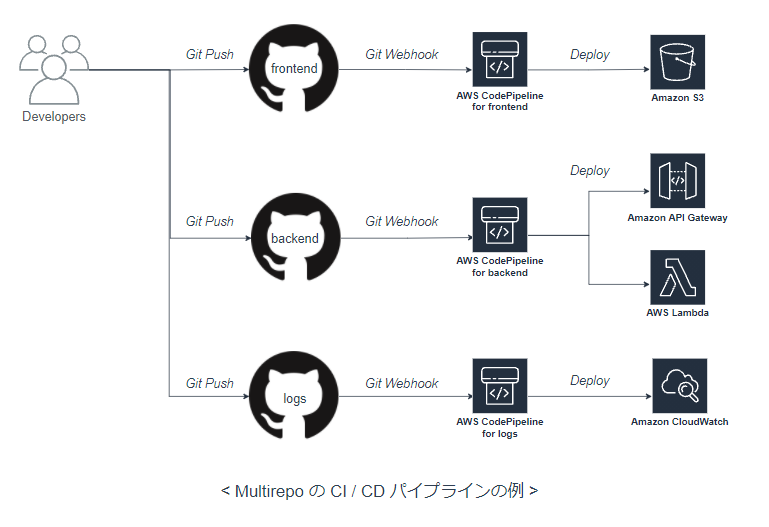
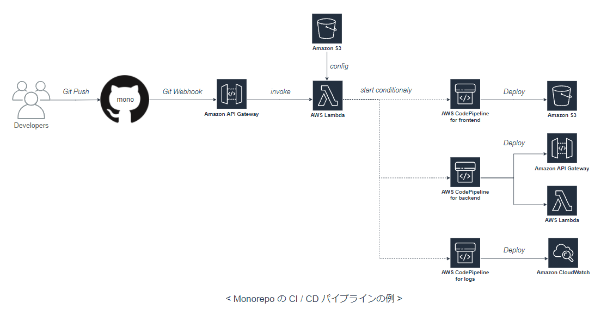
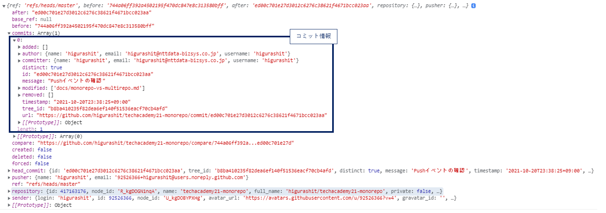

# Monorepo と Multirepo

[Back to Top](./index.md)

## Multirepo とは<sup>[1]</sup>

- サービスやライブラリを複数のリポジトリで管理する方法
- Amazon、Netflix は multi-repo パターンである

---

## Monorepo とは<sup>[2]</sup>

- すべてのサービスやライブラリを単一のリポジトリで管理する方法
- Google、Dropbox、Facebook、Twitter は mono-repo パターンである

---

## AWS × Multirepo での CI/CD パイプライン構成



## AWS × Monorepo での CI/CD パイプライン構成

[この記事](https://aws.amazon.com/jp/blogs/news/integrate-github-monorepo-with-aws-codepipeline-to-run-project-specific-ci-cd-pipelines/)を参考に構築する  


## 実装内容と得た学び（AWS × Multirepo）

- Pros
  - リポジトリと CodePipeline を紐付けやすいため、マネージドをフル活用できる
- Cons
  - それぞれのサービスが小規模の場合、全体のサービスの大きさに比べてリポジトリ管理が煩雑になる

---

## 実装内容（AWS × Monorepo）(2021/10/20 ~)

### 空の Lambda 関数の作成(2021/10/20)

東京リージョンで行う。  
デフォルト設定で`MA-higurashit-github-resolver`関数を作成。（言語は nodejs14、権限はデフォルト）  
GitHub webhook の中身を確認できるよう、event をログに出力する。

```javascript
exports.handler = async (event) => {
  console.log({ event }); // 追記

  // TODO implement
  const response = {
    statusCode: 200,
    body: JSON.stringify('Hello from Lambda!'),
  };
  return response;
};
```

Deploy して Test を行う。（テストイベントは API Gateway AWS Proxy）  
正常に動作することを確認。（Lambda）

### API Gateway の作成(2021/10/20)

東京リージョンで行う。  
HTTP API の`MA-higurashit-github-resolver`を作成。  
作成した Lambda を統合し、POST メソッドのみ作成する。  
`$default`ステージのエンドポイントが払い出されるので、`https://[api-id].execute-api.ap-northeast-1.amazonaws.com/MA-higurashit-github-resolver` をコピーする。  
Postman で POST リクエストを送り、正常に動作することを確認。（API Gateway → Lambda）

### GitHub の Webhook 設定(2021/10/20)

[ここ](https://github.com/higurashit/techacademy21-monorepo/settings/hooks/new)から Webhook を追加する

- Payload URL に API Gateway のエンドポイントを指定する。
- Content type は[この記事](https://aws.amazon.com/jp/blogs/news/integrate-github-monorepo-with-aws-codepipeline-to-run-project-specific-ci-cd-pipelines/)を参考に `application/json` を選択する。
- SSL verification は `Enable SSL verification` を選択（デフォルト）
- 「Which events would you like to trigger this webhook?」は `Just the push event` を選択（デフォルト）
- `Active` にチェックを入れて `Add Webhook` ボタンを押す

### GitHub Webhook の動作テスト(2021/10/20)

- 試しに Push をしてみる
- GitHub の Webhook 結果が 404(Not Found)に
  - POST メソッドであることは OK
  - エンドポイント誤り（統合リソースをつけていなかった）
- 再実行したところ、GitHub の Webhook 結果が 200 に
- Lambda で GitHub の Push イベントの中身が取得できた

```text
2021-10-20T14:38:31.259Z	37ab47c7-f098-4e2b-bd95-384d0cfcd189	INFO	{
  event: {
    version: '2.0',
    routeKey: 'POST /MA-higurashit-github-resolver',
    rawPath: '/MA-higurashit-github-resolver',
    rawQueryString: '',
    headers: {
      accept: '*/*',
      'content-length': '8229',
      'content-type': 'application/json',
      host: '2anno3qpm4.execute-api.ap-northeast-1.amazonaws.com',
      'user-agent': 'GitHub-Hookshot/4b2bd9b',
      'x-amzn-trace-id': 'Root=1-617029e7-23847afe1bce159818acc9cd',
      'x-forwarded-for': '140.82.115.117',
      'x-forwarded-port': '443',
      'x-forwarded-proto': 'https',
      'x-github-delivery': '64c037c6-31b3-11ec-9eec-9188c7032d27',
      'x-github-event': 'push',
      'x-github-hook-id': '324313051',
      'x-github-hook-installation-target-id': '417163176',
      'x-github-hook-installation-target-type': 'repository'
    },
    requestContext: {
      accountId: '626394096352',
      apiId: '2anno3qpm4',
      domainName: '2anno3qpm4.execute-api.ap-northeast-1.amazonaws.com',
      domainPrefix: '2anno3qpm4',
      http: [Object],
      requestId: 'Hgt8JhGntjMEJMQ=',
      routeKey: 'POST /MA-higurashit-github-resolver',
      stage: '$default',
      time: '20/Oct/2021:14:38:31 +0000',
      timeEpoch: 1634740711188
    },
    body: '{ ~ 省略(8Kbyte) ~}',
    isBase64Encoded: false
  }
}
```

body の中身を確認するとコミット情報などが取得できることを確認。（GitHub→API Gateway→Lambda）


### 得た学び

- Pros
  - サービスが小規模の場合、
  - API とフロントエンドを同時にリリースする場合に、手順が少なくて住む
- ## Cons

---

## 評価

---

[1]: https://blog.thundra.io/mono-or-multi-repository-a-dilemma-in-the-serverless-world
[2]: https://blog.thundra.io/mono-or-multi-repository-a-dilemma-in-the-serverless-world

[Back to Top](./index.md)
