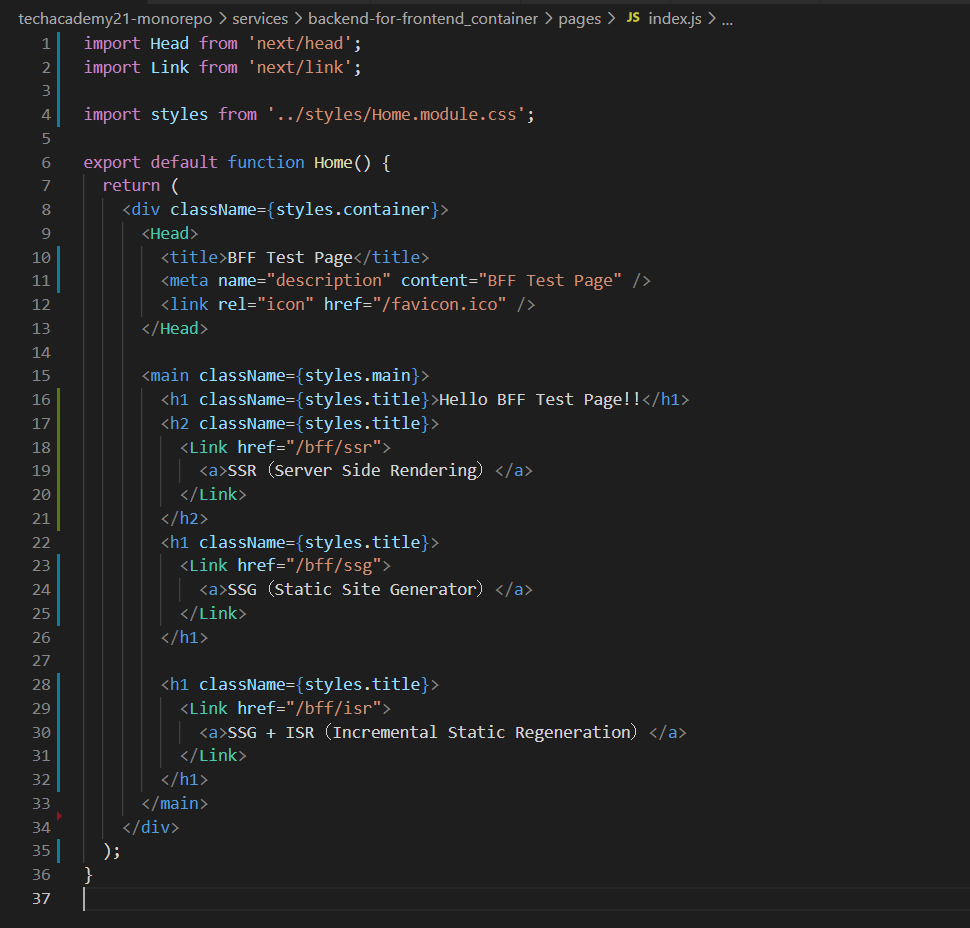
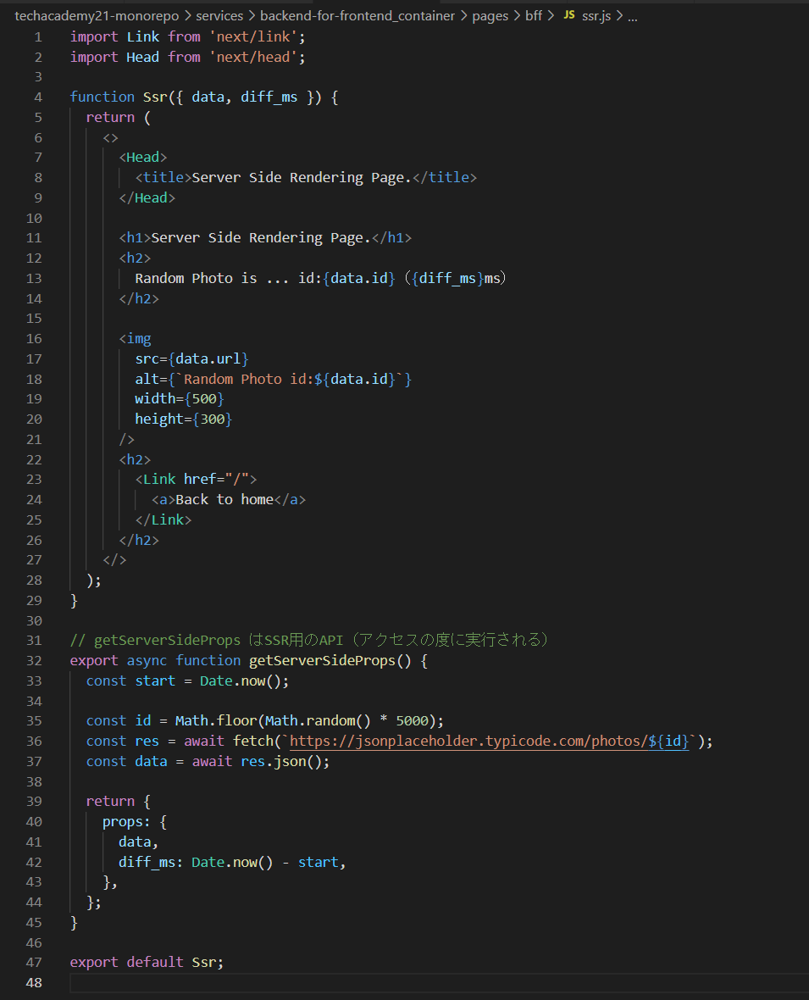
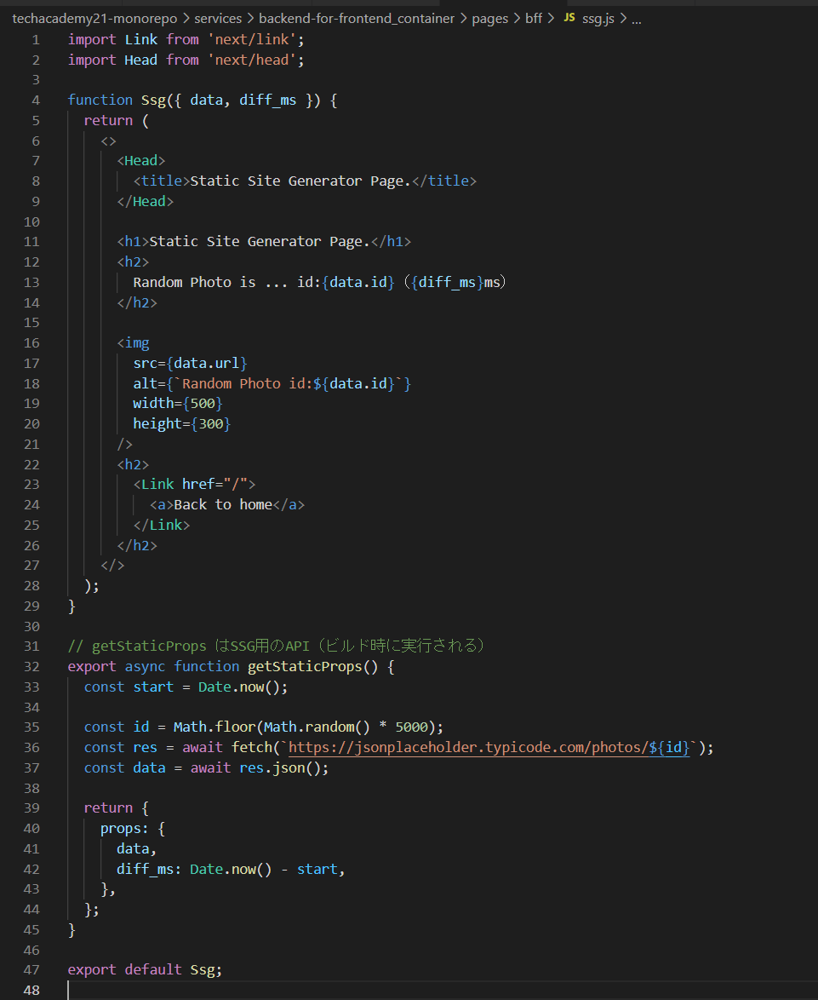
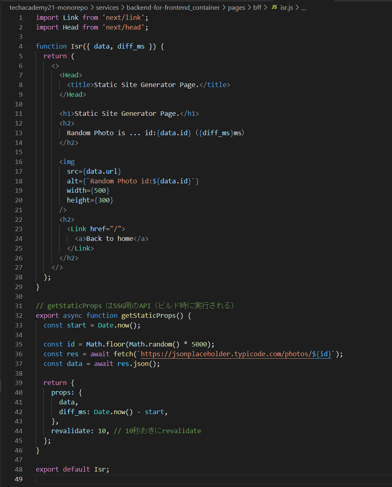
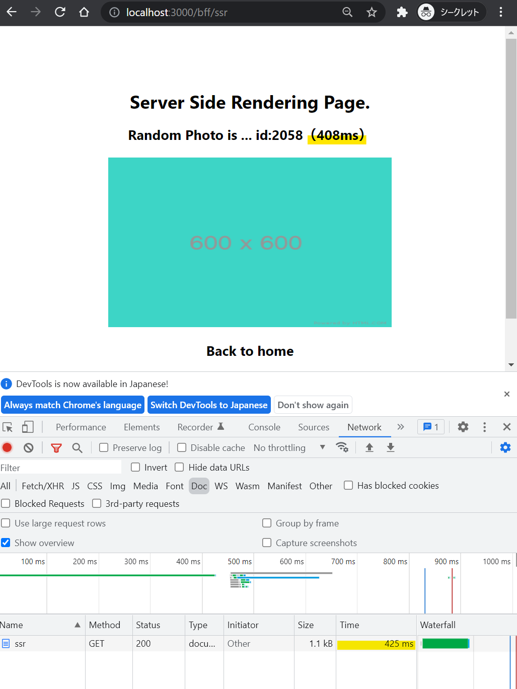
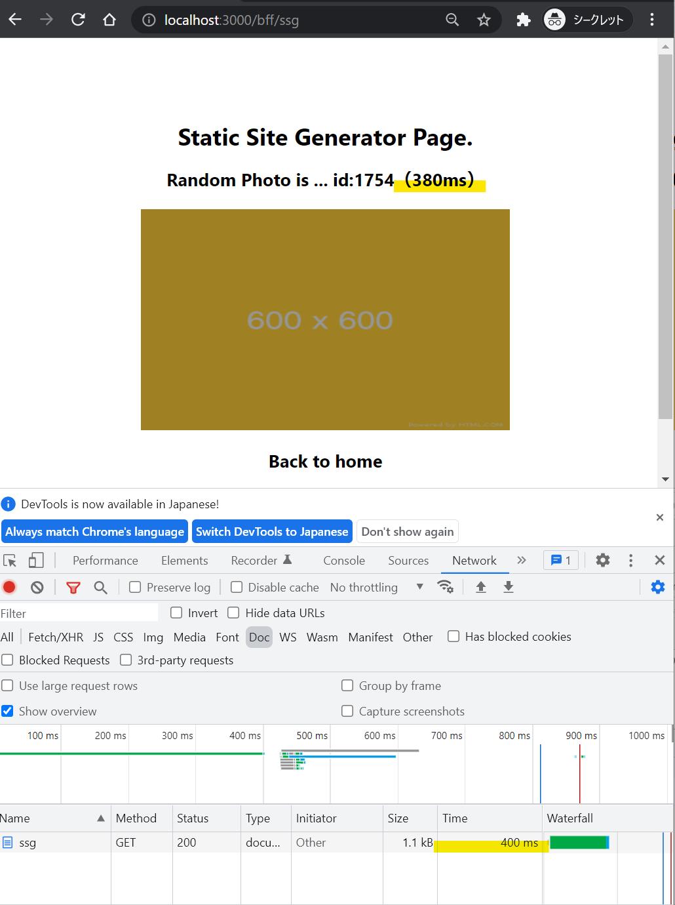
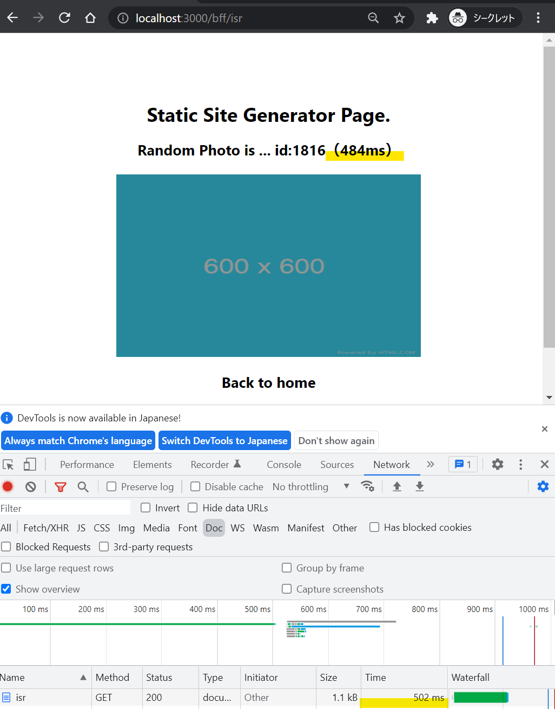
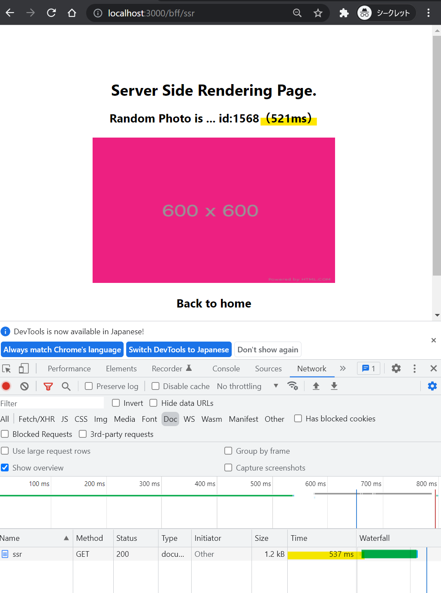
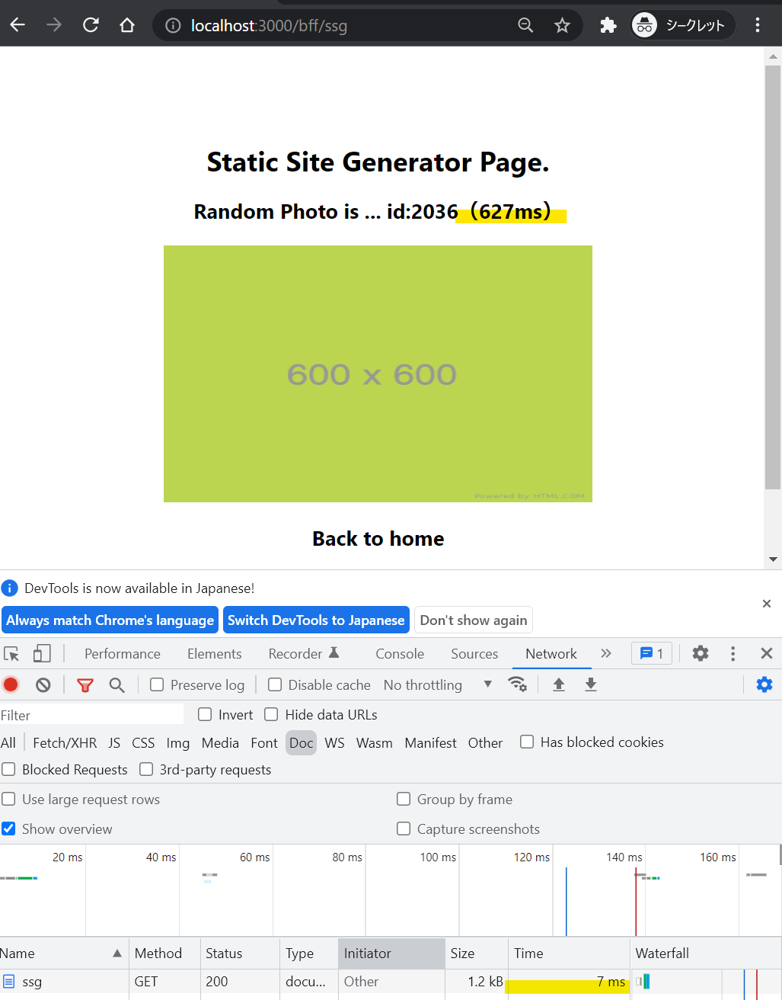
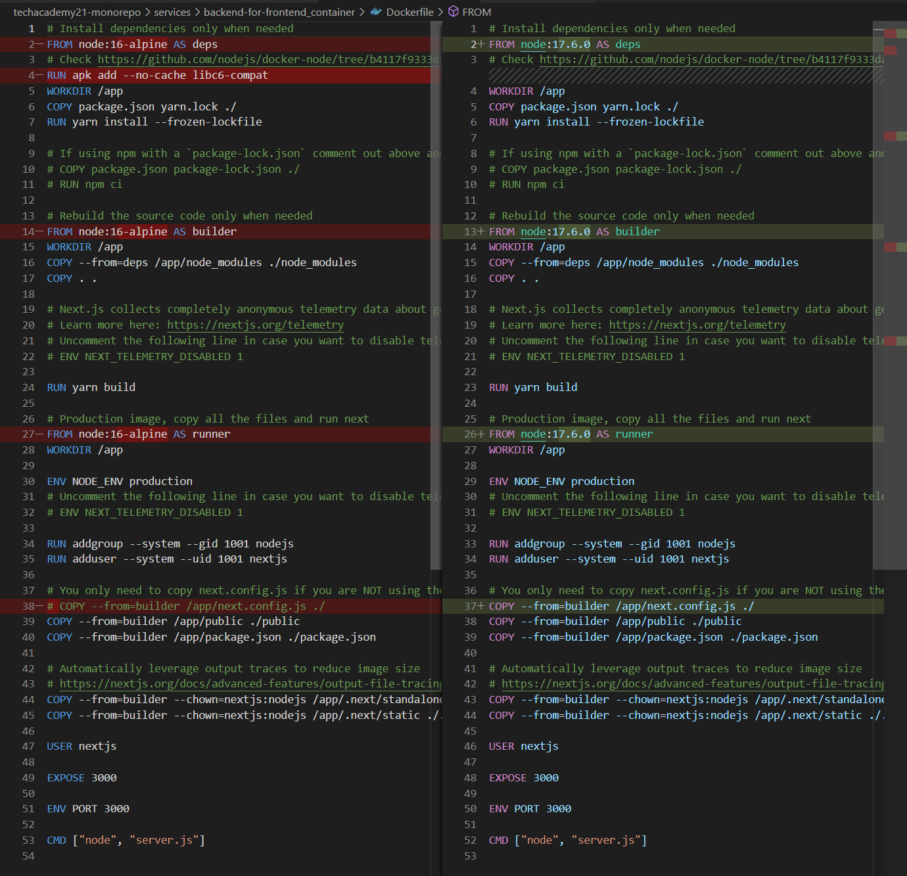

# Nextjs について

## Docker, Docker Compose のインストールまで

[WorkSpaces について](./amazon-workspaces.md) を参照

## Nextjs アプリの作成

- Dockerfile の作成（2022/2/28 時点の最新 node）

  - `touch Dockerfile`
  - `vi Dockerfile`

    ```
    FROM node:17.6.0-alpine

    WORKDIR /usr/src/app
    ```

- docker-compase.yaml の作成

  - `touch docker-compase.yaml`
  - `vi docker-compase.yaml`

    ```
    version: "3"
    services:
      nextjs:
        dns: 8.8.8.8 # add this line
        build:
          context: .
          dockerfile: Dockerfile
        ports:
          - "3000:3000"
        container_name: nextjs-app
        volumes:
          - ./:/usr/src/app/next
        command: sh -c "cd MA-higurashit-nextjs-app && npm run dev"
    ```

- （おまけ）本番で実行する Nextjs 用の Docker を利用して create-next-app コマンドを実行

  - `docker-compose run --rm nextjs sh -c "npm install create-next-app && npx create-next-app ma-higurashit-nextjs-app --ts"`
  - docker-compose.yaml の nextjs サービスで、`sh -c` を使ってコマンドを実行（複数コマンドのため`sh`を利用）
  - create-next-app のインストールと、ma-higurashit-nextjs-app アプリケーションを作成
  - 【問題】`ls -l` してもフォルダが作成されてない（コンテナ内のみ？？）

    ```
    [私は名前がありません!@a-3mpaoy5w8ussf nextjs-sample]$ ls -l
    合計 8
    -rw-r--r-- 1 TEC\higurashit TEC\domain users 47 2 月 28 03:12 Dockerfile
    -rw-r--r-- 1 TEC\higurashit TEC\domain users 292 2 月 28 03:11 docker-compose.yaml
    [私は名前がありません!@a-3mpaoy5w8ussf nextjs-sample]$
    ```

    - 【解決】docker-compase.yaml の volumes が Dockerfile とずれていた（/usr/src/app/next → /usr/sec/app）

  - 【問題】create-next-app コマンドで`Error: EACCES: permission denied, scandir '/root/.npm/_logs`エラーが出る - 権限エラーのようなので whoami を実行 - `docker-compose run --rm nextjs whoami`
    - 結果は root ...
  - ディレクトリの権限を確認 - `docker-compose run --rm nextjs ls -ld /root/ /root/.npm/ /root/.npm/_logs`
    - 結果は root
    ```
    [私は名前がありません!@a-3mpaoy5w8ussf nextjs-sample]$ docker-compose run --rm nextjs ls -ld /root/ /root/.npm/ /root/.npm/\_logs
    Creating nextjs-sample_nextjs_run ... done
    drwx------ 1 root root 20 Feb 23 18:28 /root/
    drwxr-xr-x 3 root root 19 Feb 23 18:28 /root/.npm/
    drwxr-xr-x 2 root root 50 Feb 23 18:28 /root/.npm/\_logs
    ```
  - Dockerfile に `USER node`を追加する...だめ
  - Dockerfile の WORKDIR を /home/ 配下にする...だめ
  - node のバージョンを`16.14.0`にダウングレード...だめ
  - [この記事](https://okoysm.hatenablog.jp/entry/2016/06/11/214459)を試してみる
    - 対策 1
      ```
      [TEC\higurashit@a-3mpaoy5w8ussf nextjs-sample]$ dc run --rm nextjs npm config get prefix
      Creating nextjs-sample_nextjs_run ... done
      /usr/local
      ```
    - 対策 2...Docker じゃないから中断

- [ここ](https://qiita.com/hiyuzawa/items/81490020568417d85e86)を見て一回学習...
- [Aurh0 の記事](https://auth0.com/blog/jp-use-docker-to-create-a-node-development-environment/)も見る
- もしかすると[これ](https://stackoverflow.com/questions/44633419/no-access-permission-error-with-npm-global-install-on-docker-image)かも

  - `npm -g config set user root`
  - `docker-compose run --rm nextjs sh -c "npm -g config set user root && npm install create-next-app && npx create-next-app ma-higurashit-nextjs-app --ts"`
  - [Docker について](./docker.md)の Tips に移動...

## nextjs アプリの作成

- create-next-app でアプリの雛形を作成
  - /pages/index.js が http://localhost:3000/ でアクセスした時の実行 javascript
    各ページの導線を配置する
    
- SSR のページを作成する
  - /pages/bff/ssr.js（これで http://localhost:3000/bff/ssr でアクセスできる）
  - SSR には getServerSideProps メソッドを記述する（アクセスの度に実行される）
    
- SSG のページを作成する
  - /pages/bff/ssg.js（これで http://localhost:3000/bff/ssg でアクセスできる）
  - SSG には getStaticProps メソッドを記述する（npm run build 時のみ実行される）
    
- SSG + ISR のページを作成する
  - /pages/bff/isr.js（これで http://localhost:3000/bff/isr でアクセスできる）
  - getStaticProps メソッドの返却値に revalidate: 10 を設定する（10 秒おきに再生成）
    
- `yarn dev` でローカルサーバを起動しても、常にリレンダリングされる
  - /bff/ssr にアクセス（リンク遷移後にリロード）
    - API のデータ取得に 408ms, 画面返却に 425ms
      
  - /bff/ssg にアクセス（〃）
    - API のデータ取得に 380ms, 画面返却に 400ms
      
  - /bff/isr にアクセス（〃）
    - API のデータ取得に 484ms, 画面返却に 502ms
      
- `yarn build` で production 用をビルド
  - ビルドログで SSR, SSG, SSG + ISR がわかるようになっている（/.next/にビルド資材が格納される）
    
    - SSG + ISR は revalidate: 10 seconds + ビルド時間 520ms
    - SSG はビルド時間 675ms
    - SSR はビルド時間の表示なし
- `yarn start` で production 用をローカル実行
  - /bff/ssr にアクセス（リンク遷移後にリロード）
    - API のデータ取得に 521ms, 画面返却に 537ms
      
  - /bff/ssg にアクセス（〃）
    - API のデータ取得に 627ms, 画面返却に 7ms
      
  - /bff/isr にアクセス（〃）
    - API のデータ取得に 371ms, 画面返却に 5ms
      
  - ローカルは通信が発生しないため、恐ろしく早い

## nextjs アプリの DockerImage 作成

- [ここ](https://nextjs.org/docs/deployment#docker-image)を参照する

  - 別のディレクトリに`npx create-next-app --example with-docker nextjs-docker`で example プロジェクトを作成
  - nextjs 部分はデフォルトのままのため、Docker 系のファイルの移動で良さそう
  - 必要なファイルを移動
    - Dockerfile
    - next.config.js の一部設定
    - .dockerignore
  - app.json は GCP 用のようなので放置
  - `docker build -t nextjs-docker .`

    - error checking context: 'no permission to read from '/home/higurashit/MyProject/techacademy21-monorepo/services/backend-for-frontend_container/.bash_history''. が発生
      - /root/ で実行していた時の bash_history が残っていたよう
      - .dockerignore に追加して再実行（削除でも良かったか）
    - unable to select packages: libc6-compat (no such package):
      - alpine 用の apk add コマンドが落ちている
      - slim を使うよう Dockerfile を修正
        

  - `docker run -p 3000:3000 nextjs-docker`
