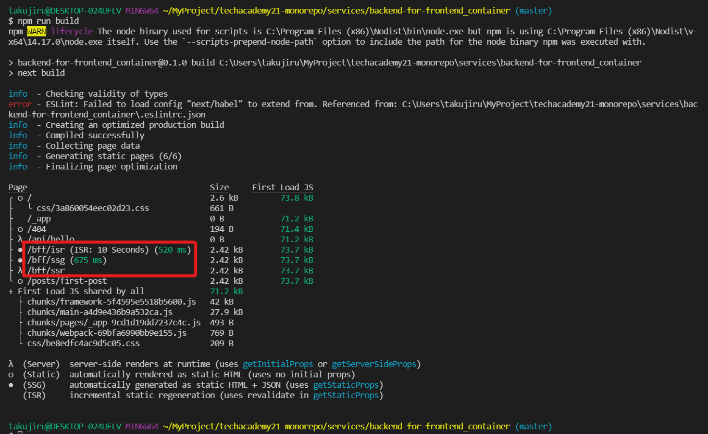
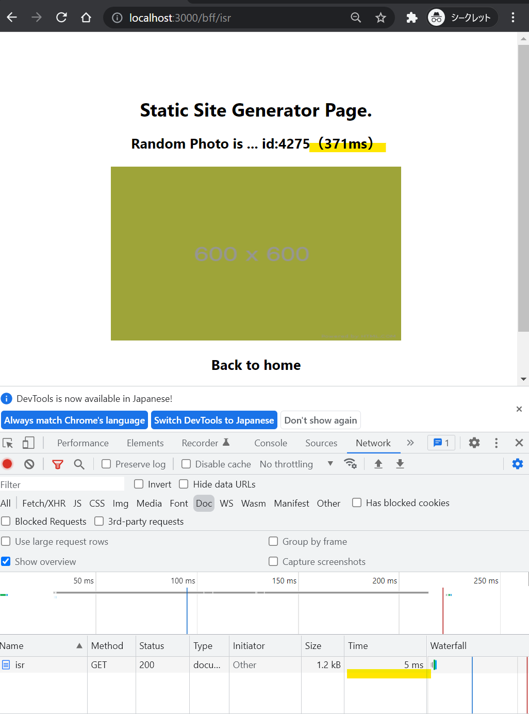
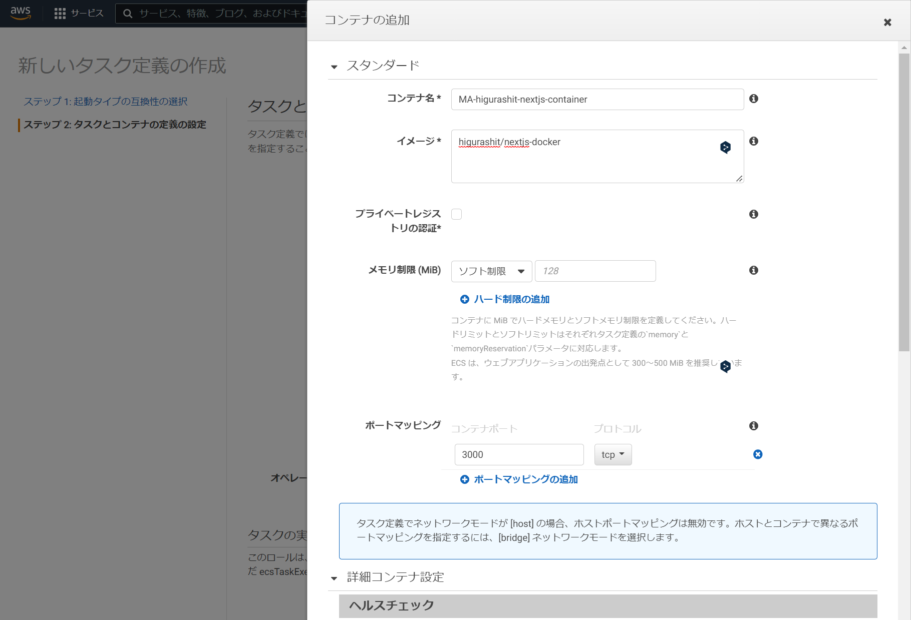
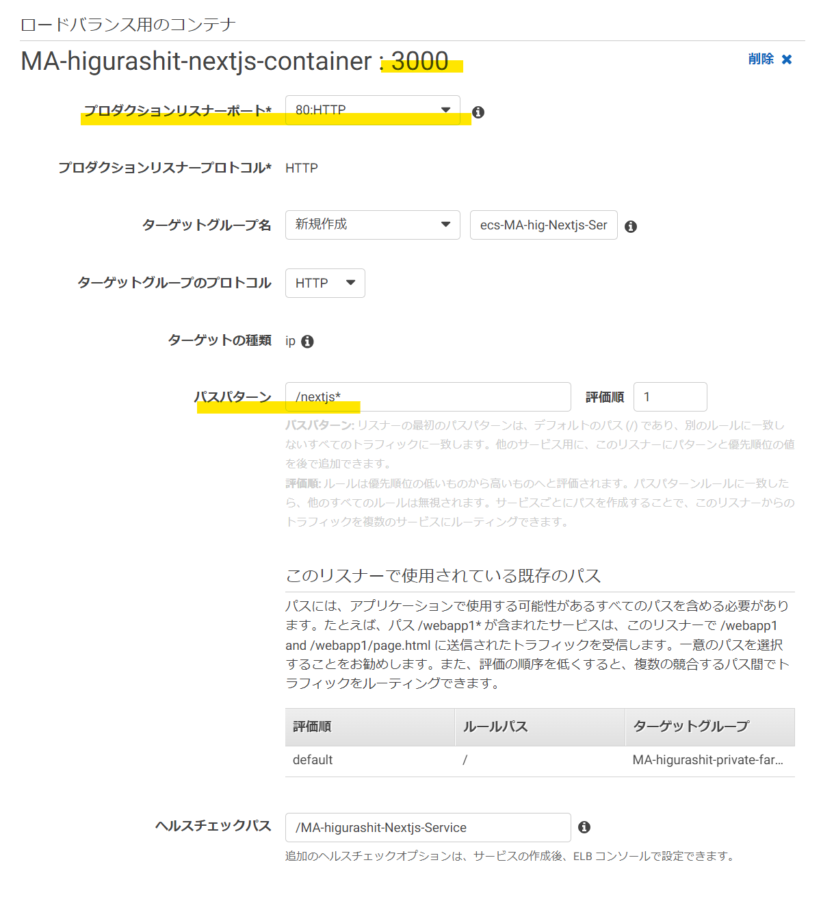

# Nextjs について

## Docker, Docker Compose のインストールまで

[WorkSpaces について](./amazon-workspaces.md) を参照

## Nextjs アプリの作成

- Dockerfile の作成（2022/2/28 時点の最新 node）

  - `touch Dockerfile`
  - `vi Dockerfile`

    ```
    FROM node:17.6.0-alpine

    WORKDIR /usr/src/app
    ```

- docker-compase.yaml の作成

  - `touch docker-compase.yaml`
  - `vi docker-compase.yaml`

    ```
    version: "3"
    services:
      nextjs:
        dns: 8.8.8.8 # add this line
        build:
          context: .
          dockerfile: Dockerfile
        ports:
          - "3000:3000"
        container_name: nextjs-app
        volumes:
          - ./:/usr/src/app/next
        command: sh -c "cd MA-higurashit-nextjs-app && npm run dev"
    ```

- （おまけ）本番で実行する Nextjs 用の Docker を利用して create-next-app コマンドを実行

  - `docker-compose run --rm nextjs sh -c "npm install create-next-app && npx create-next-app ma-higurashit-nextjs-app --ts"`
  - docker-compose.yaml の nextjs サービスで、`sh -c` を使ってコマンドを実行（複数コマンドのため`sh`を利用）
  - create-next-app のインストールと、ma-higurashit-nextjs-app アプリケーションを作成
  - 【問題】`ls -l` してもフォルダが作成されてない（コンテナ内のみ？？）

    ```
    [私は名前がありません!@a-3mpaoy5w8ussf nextjs-sample]$ ls -l
    合計 8
    -rw-r--r-- 1 TEC\higurashit TEC\domain users 47 2 月 28 03:12 Dockerfile
    -rw-r--r-- 1 TEC\higurashit TEC\domain users 292 2 月 28 03:11 docker-compose.yaml
    [私は名前がありません!@a-3mpaoy5w8ussf nextjs-sample]$
    ```

    - 【解決】docker-compase.yaml の volumes が Dockerfile とずれていた（/usr/src/app/next → /usr/sec/app）

  - 【問題】create-next-app コマンドで`Error: EACCES: permission denied, scandir '/root/.npm/_logs`エラーが出る - 権限エラーのようなので whoami を実行 - `docker-compose run --rm nextjs whoami`
    - 結果は root ...
  - ディレクトリの権限を確認 - `docker-compose run --rm nextjs ls -ld /root/ /root/.npm/ /root/.npm/_logs`
    - 結果は root
    ```
    [私は名前がありません!@a-3mpaoy5w8ussf nextjs-sample]$ docker-compose run --rm nextjs ls -ld /root/ /root/.npm/ /root/.npm/\_logs
    Creating nextjs-sample_nextjs_run ... done
    drwx------ 1 root root 20 Feb 23 18:28 /root/
    drwxr-xr-x 3 root root 19 Feb 23 18:28 /root/.npm/
    drwxr-xr-x 2 root root 50 Feb 23 18:28 /root/.npm/\_logs
    ```
  - Dockerfile に `USER node`を追加する...だめ
  - Dockerfile の WORKDIR を /home/ 配下にする...だめ
  - node のバージョンを`16.14.0`にダウングレード...だめ
  - [この記事](https://okoysm.hatenablog.jp/entry/2016/06/11/214459)を試してみる
    - 対策 1
      ```
      [TEC\higurashit@a-3mpaoy5w8ussf nextjs-sample]$ dc run --rm nextjs npm config get prefix
      Creating nextjs-sample_nextjs_run ... done
      /usr/local
      ```
    - 対策 2...Docker じゃないから中断

- [ここ](https://qiita.com/hiyuzawa/items/81490020568417d85e86)を見て一回学習...
- [Aurh0 の記事](https://auth0.com/blog/jp-use-docker-to-create-a-node-development-environment/)も見る
- もしかすると[これ](https://stackoverflow.com/questions/44633419/no-access-permission-error-with-npm-global-install-on-docker-image)かも

  - `npm -g config set user root`
  - `docker-compose run --rm nextjs sh -c "npm -g config set user root && npm install create-next-app && npx create-next-app ma-higurashit-nextjs-app --ts"`
  - [Docker について](./docker.md)の Tips に移動...

## nextjs アプリの作成

- create-next-app でアプリの雛形を作成
  - /pages/index.js が http://localhost:3000/ でアクセスした時の実行 javascript
    各ページの導線を配置する
    
- SSR のページを作成する
  - /pages/bff/ssr.js（これで http://localhost:3000/bff/ssr でアクセスできる）
  - SSR には getServerSideProps メソッドを記述する（アクセスの度に実行される）
    
- SSG のページを作成する
  - /pages/bff/ssg.js（これで http://localhost:3000/bff/ssg でアクセスできる）
  - SSG には getStaticProps メソッドを記述する（npm run build 時のみ実行される）
    
- SSG + ISR のページを作成する
  - /pages/bff/isr.js（これで http://localhost:3000/bff/isr でアクセスできる）
  - getStaticProps メソッドの返却値に revalidate: 10 を設定する（10 秒おきに再生成）
    
- `yarn dev` でローカルサーバを起動しても、常にリレンダリングされる
  - /bff/ssr にアクセス（リンク遷移後にリロード）
    - API のデータ取得に 408ms, 画面返却に 425ms
      
  - /bff/ssg にアクセス（〃）
    - API のデータ取得に 380ms, 画面返却に 400ms
      
  - /bff/isr にアクセス（〃）
    - API のデータ取得に 484ms, 画面返却に 502ms
      
- `yarn build` で production 用をビルド
  - ビルドログで SSR, SSG, SSG + ISR がわかるようになっている（/.next/にビルド資材が格納される）
    
    - SSG + ISR は revalidate: 10 seconds + ビルド時間 520ms
    - SSG はビルド時間 675ms
    - SSR はビルド時間の表示なし
- `yarn start` で production 用をローカル実行
  - /bff/ssr にアクセス（リンク遷移後にリロード）
    - API のデータ取得に 521ms, 画面返却に 537ms
      
  - /bff/ssg にアクセス（〃）
    - API のデータ取得に 627ms, 画面返却に 7ms
      
  - /bff/isr にアクセス（〃）
    - API のデータ取得に 371ms, 画面返却に 5ms
      
  - ローカルは通信が発生しないため、恐ろしく早い

## nextjs アプリの DockerImage 作成

- [ここ](https://nextjs.org/docs/deployment#docker-image)を参照する

  - 別のディレクトリに`npx create-next-app --example with-docker nextjs-docker`で example プロジェクトを作成
  - nextjs 部分はデフォルトのままのため、Docker 系のファイルの移動で良さそう
  - 必要なファイルを移動
    - Dockerfile
    - next.config.js の一部設定
    - .dockerignore
  - app.json は GCP 用のようなので放置
  - `d build -t nextjs-docker .`
    - 【問題】error checking context: 'no permission to read from '/home/higurashit/MyProject/techacademy21-monorepo/services/backend-for-frontend_container/.bash_history''. が発生
      - /root/ で実行していた時の bash_history が残っていたよう
      - .dockerignore に追加して再実行（削除でも良かったか）
    - 【問題】unable to select packages: libc6-compat (no such package):
      - alpine 用の apk add コマンドが落ちている
      - slim を使うよう Dockerfile を修正
        
    - 【問題】info There appears to be trouble with your network connection. Retrying...
      - yarn install がうまくいってない。Dockerfile に dns 設定を追加
        - 修正前）RUN yarn install --frozen-lockfile
        - 修正後）RUN echo 'nameserver 8.8.8.8' >> /etc/resolv.conf && yarn install --frozen-lockfile
      - 直らない。Timeout かもしれないので設定する（タイムアウト 1 分）
        - 修正前）RUN echo 'nameserver 8.8.8.8' >> /etc/resolv.conf && yarn install --frozen-lockfile
        - 修正後）RUN echo 'nameserver 8.8.8.8' >> /etc/resolv.conf && yarn install --frozen-lockfile --network-timeout 60000
      - 直らない。サーバに入ってトラブルシュート。Dockerfile をトレースして run する
        - Dockerfile は以下の通り
          ```
          # Install dependencies only when needed
          FROM node:17.6.0 AS deps
          # Check https://github.com/nodejs/docker-node/tree/b4117f9333da4138b03a546ec926ef50a31506c3#nodealpine to understand why libc6-compat might be needed.
          WORKDIR /app
          COPY package.json yarn.lock ./
          RUN echo 'nameserver 8.8.8.8' >> /etc/resolv.conf && yarn install --frozen-lockfile
          ```
        - ［H］`d run --rm -it --name=test --workdir=/app node:17.6.0 /bin/bash`
        - ［C］Ctrl + P → Q でデタッチ
        - ［H］`d cp package.json test:/app`
        - ［H］`d cp yaran.lock test:/app`
        - ［H］`d attach test`
        - ［C］`ls -l`
          - ファイルが存在する
        - ［C］`cat /etc/resolve.conf`
        - ［C］`echo 'nameserver 8.8.8.8' >> /etc/resolv.conf` ※RUN の 1 つ目
        - ［C］`cat /etc/resolve.conf`
          - nameserver が追加されたことを確認
        - ［C］`yarn install --frozen-lockfile` ※RUN の 2 つ目、タイムアウト指定なし
          - やはり通信できていない。
        - ［C］`ping https://registry.yarnpkg.com/babel-eslint`
          - ping コマンドが無い
          - `apt-get update && apt-get install iputils-ping`
            - 通信エラーっぽい...
            - docker run に --dns オプションをつけるとどうか
        - ［C］Ctrl + D でコンテナを抜ける（削除される）
        - ［H］`d run --rm -it --dns=8.8.8.8 --name=test --workdir=/app node:17.6.0 /bin/bash`
        - ［C］Ctrl + P → Q でデタッチ
        - ［H］`d cp package.json test:/app`
        - ［H］`d cp yaran.lock test:/app`
        - ［H］`d attach test`
        - ［C］`yarn install --frozen-lockfile` ※RUN の 2 つ目、タイムアウト指定なし
          - 通信できてる...
          - Your lockfile needs to be updated, but yarn was run with `--frozen-lockfile`. エラー
          - `yarn install` で正常に動作することを確認
          - https://kazuhira-r.hatenablog.com/entry/2020/04/12/194225 によると、docker build 時に host のネットワークが使えるとのこと
  - `d build --network host -t nextjs-docker .`
    - 【問題】Your lockfile needs to be updated, but yarn was run with `--frozen-lockfile`. エラー
      - yarn.log を改めて作り直したら通った
    - いくつか WARNING が出ているが正常終了（SSG のビルドもされているっぽい）
  - `d run -p 3000:3000 nextjs-docker`
    - https://localhost:3000 でつながることを確認
    - 【問題】SSR の画面でコンソールエラー
      - 結局、コンテナから外の API を叩かないといけない
      - docker-compose は dns 周りをやってくれるとの情報あり
      - docker-compose.yaml を作成する
        ```
        version: '3.9' # optional since v1.27.0
        services:
          nextjs:
            build:
              context: .
              dockerfile: Dockerfile
            container_name: nextjs-app
            dns: 8.8.8.8
        ```
  - `dc up`
    - 【問題】SSG 作成で通信エラー
      - d run で --dns をつけているとうまくいくところに立ち返る
      - どうにも良い情報がない

- そもそも問題が起きているのか？
  - `d images`
    - nextjs-docker:latest が存在する
  - `d run --rm -p 3000:3000 --dns=8.8.8.8 nextjs-docker:latest`
    - 動作する
    - パラメータは ECS で設定すればよいのでは？（ローカル開発も ECS 上の動作もできるなら OK）
- まとめ
  - ローカルでの実行時：`npm dev`
  - リリース前のビルド時：`d build --network host -t nextjs-docker .`
  - ビルドイメージからの実行時：`d run --rm -p 3000:3000 --dns=8.8.8.8 nextjs-docker:latest`
- リリース準備
  - `d login`
  - `d tag nextjs-docker higurashit/nextjs-docker` # build 時のタグでユーザ名をつけておいていいかも
  - `d push higurashit/nextjs-docker`
  - https://hub.docker.com/repository/docker/higurashit/nextjs-docker
- ECS の設定
  
  
  - 【問題】全部 Pending に
    - タスク定義ーコンテナの定義で DNS サーバを設定していない
    - DNS サーバはネットワークモードが awsvpc だと設定できない。Fargate は awsvpc 縛りなので詰み？
    - d run でコンテナを作成して commit する方法はどうか？
  - 【解決】resolve.conf じゃなくて resolv.conf だった...
